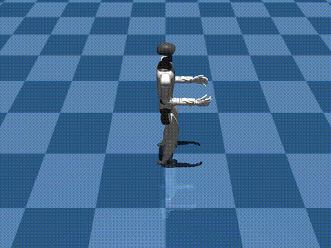

# Kinematic Planner

The planning package (`strands_robots.planning`) is the **intent layer** at the
top of the locomotion control stack. Instead of commanding joint targets, you
steer a robot by *velocity, height and movement style* - from a keyboard,
gamepad, LLM agent, or a scripted timeline - and the planner converts that
intent into the locomotion goal the policy already consumes.



*A Unitree G1 driven by a `KinematicPlanner`: a scripted velocity/yaw sequence
(forward -> curving left -> faster forward) feeds the WBC locomotion policy. The
robot covers ~1.5 m forward and ~1.2 m laterally while staying upright. Rendered
headless in MuJoCo.*

## Where it sits

```
 keyboard / gamepad / agent / scripted   (intent)
                |
                v
         KinematicPlanner    --> PlannerCommand{root_vel, height, style}
                |  to_policy_kwargs()
                v
   locomotion Policy (WBC, ...)   reads target_velocity / target_height / locomotion_style
                |
                v
             robot joints
```

A planner does not introduce a second goal API on the policy. It maps each
command onto the **existing** locomotion goal-kwarg contract (the
`target_velocity` `policy_kwargs` that WBC and other non-VLA providers already
read), so it composes with `run_policy` unchanged.

## Quick start

```python
from strands_robots import Robot
from strands_robots.planning import KinematicPlanner
from strands_robots.planning.inputs import KeyboardInput

robot = Robot("unitree_g1")
robot.run_policy(
    policy_provider="wbc",
    policy_config={"checkpoint": "/path/to/grootwbc-g1", "walk": True},
    planner=KinematicPlanner(KeyboardInput()),  # NEW kwarg
    duration=60.0,
    control_frequency=50.0,
)
```

Each control tick the runner samples `planner.poll().to_policy_kwargs()` and
merges it over the static `policy_kwargs` (planner wins), so the locomotion goal
varies over time under live control.

## PlannerCommand

A single immutable, JSON-serialisable intent:

| field      | meaning                                            |
|------------|----------------------------------------------------|
| `root_vel` | base velocity `(vx, vy, omega)` - m/s, m/s, rad/s  |
| `height`   | target base height (m)                             |
| `style`    | movement style (see below)                         |

`to_dict()` / `from_dict()` make it mesh-transport friendly - a remote peer can
stream commands to a locomotion node unchanged.

### Movement styles

Style names match the GR00T Whole-Body-Control SONIC demos exactly:
`run`, `happy`, `stealth`, `injured`, `kneeling`, `hand_crawling`,
`elbow_crawling`, `boxing`. A policy that does not understand a style ignores
the `locomotion_style` kwarg, so emitting a style is always safe; a
style-conditioned policy uses it to switch gaits.

The [MotionBricks](../policies/motionbricks.md) provider (`policy_provider="motionbricks"`)
is style-conditioned: it translates the planner's `locomotion_style` to the
matching G1 clip (`stealth` -> `stealth_walk`, `boxing` -> `walk_boxing`, ...),
so a planner switches the synthesised gait live. See the MotionBricks page for
the full style-to-clip table.

## Input sources

Every source is a non-blocking `InputSource` the planner polls on a background
thread, so reading intent never stalls the control loop.

- **`KeyboardInput`** - WASD move, QE turn, RF height, space halt, `1`-`8`
  style, ESC stop. Degrades to a no-op when stdin is not a TTY.
- **`GamepadInput`** - analog sticks + buttons. Needs the optional `pygame`
  dependency (`pip install "strands-robots[planning]"`).
- **`AgentInput`** - hand it a `strands.Agent` and a goal string; the agent gets
  a `set_locomotion_intent` tool and decomposes natural language into a stream
  of commands.
- **`ScriptedInput`** - a deterministic timed schedule of updates. Headless and
  reproducible; ideal for demos and tests.

## Clamping and debounce

`KinematicPlanner` clamps velocity to `+/- max_speed` (yaw to `+/- max_omega`)
and height into `height_range`, and debounces style switches by
`style_debounce_s` so a key/button bounce does not thrash the gait. An ESC /
`stop=True` zeroes velocity and sets `planner.stop_requested`, which a caller
driving a long rollout may poll to break early.

## Examples

- `examples/planner/scripted_g1.py` - the headless demo above.
- `examples/planner/keyboard_g1.py` - drive a G1 live from the terminal.
- `examples/planner/agent_g1.py "walk then crawl then stand"` - natural-language
  steering.
