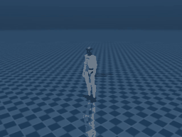

# MotionBricks



*Kinematic rollout in MuJoCo (headless, `MUJOCO_GL=egl`): the G1 cycles through `walk`, `stealth_walk`, and `walk_boxing` styles.*

[`MotionBricksPolicy`](https://github.com/strands-labs/robots/blob/main/strands_robots/policies/motionbricks/policy.py)
wraps NVIDIA's [MotionBricks](https://nvlabs.github.io/motionbricks/) generative
motion model (the `motionbricks/` subproject of
[GR00T-WholeBodyControl](https://github.com/NVlabs/GR00T-WholeBodyControl)).
MotionBricks is a **generative kinematic motion model**: given a high-level
*style* (a clip mode such as `walk` / `stealth_walk` / `walk_boxing`) plus a
movement/facing command, it synthesises per-frame full-body `qpos` for the
Unitree G1, faster than real time.

Like the other non-VLA providers (`wbc`, cuRobo, MoveIt2) it runs **in the same
process** (torch, no sidecar):

- `requires_images = False` - driven by a style + direction command, never
  camera frames.
- `get_actions` reads its goal from the well-known `**kwargs`
  (`style` / `mode`, `target_velocity`, `target_heading`), ignoring the
  instruction string.
- Each call advances the generator **one frame synchronously, no threads** and
  returns the G1's 29 leg+waist+arm joint targets keyed by joint name.

## Where it sits in the stack

MotionBricks is a *higher* layer than WBC, not a replacement. It generates the
motion *targets*; a tracking controller turns them into torques under physics:

```
high-level intent (style, direction)
        |
        v
MotionBricks            <- THIS provider: per-frame motion targets (root + joint refs)
        |
        v
WBCPolicy / GEAR-SONIC  <- tracks the targets: joint torques / position targets
        |
        v
robot (sim or hardware)
```

The two compose through
[`CompositePolicy`](https://github.com/strands-labs/robots/blob/main/strands_robots/policies/composite.py):
MotionBricks emits the joint references, WBC tracks them. The 29 joints are
keyed by the **same canonical ordering as WBC** (`MOTIONBRICKS_G1_JOINTS` is
`WBC_G1_ALL_JOINTS`), so the two name the same joints without a remapping table.

Standalone, the policy's output is a kinematic reference - the faithful way to
visualise a kinematic generator is to set the synthesised `qpos`
(`policy.last_qpos`) and run forward kinematics, exactly like the upstream
`interactive_demo_g1.py`.

## Install

The `motionbricks` package is **not** on PyPI. Install the PyPI support
libraries via the extra, then the upstream package editable, then fetch the
checkpoints with git-LFS (~2.2 GB, NVIDIA Open Model License - no weights are
bundled):

```bash
pip install "strands-robots[motionbricks]"

git clone https://github.com/NVlabs/GR00T-WholeBodyControl.git
cd GR00T-WholeBodyControl
git lfs install
# The parent repo skips MotionBricks checkpoints by default (.lfsconfig
# fetchexclude); --exclude="" overrides that so the weights actually download.
git lfs pull --include="motionbricks/out/**" --exclude=""
git lfs pull --include="motionbricks/assets/skeletons/g1/meshes/**" --exclude=""
pip install -e motionbricks

# Verify the checkpoints are real files, not LFS pointers:
ls -lh motionbricks/out/G1-clip.ckpt                                    # ~7.5 MB
ls -lh motionbricks/out/motionbricks_pose/version_1/checkpoints/*.ckpt  # ~1.6 GB
ls -lh motionbricks/out/motionbricks_root/version_1/checkpoints/*.ckpt  # ~391 MB
ls -lh motionbricks/out/motionbricks_vqvae/version_1/checkpoints/*.ckpt # ~273 MB
```

A CUDA GPU is recommended; `device="cpu"` also works (slower, but the kinematic
generator still runs well above real time on CPU).

## Usage

```python
from strands_robots.policies.motionbricks import MotionBricksConfig, MotionBricksPolicy

config = MotionBricksConfig(
    result_dir="/path/to/GR00T-WholeBodyControl/motionbricks/out",
    device="cuda",          # or "cpu"
    style="walk",
)
policy = MotionBricksPolicy(config=config)

# One synthesis frame -> 29 joint targets keyed by G1 joint name.
actions = policy.get_actions_sync({}, "", style="stealth_walk")
joint_targets = actions[0]            # {"left_hip_pitch_joint": ..., ...}
full_qpos = policy.last_qpos          # [root(7), joints(29)] for kinematic viz
```

Or through the factory / a simulation:

```python
from strands_robots.policies import create_policy

policy = create_policy(
    "motionbricks",
    result_dir="/path/to/.../motionbricks/out",
    style="walk",
)
```

### Configuration

| `MotionBricksConfig` field | Meaning | Default |
| --- | --- | --- |
| `result_dir` | Path to the upstream `out/` checkpoint tree | required |
| `skeleton_xml` / `scene_xml` | G1 skeleton / scene MuJoCo XML | derived from `result_dir` |
| `clips` | Clip set name | `"G1"` |
| `style` | Default mode (index or name) | `"walk"` |
| `generate_dt` | Synthesis horizon multiplier | `2.0` |
| `fps` | Motion frame rate | `30` |
| `device` | Torch device | `"cuda"` |
| `speed_scale` | `(min, max)` root-velocity perturbation | `(1.0, 1.0)` |

### Per-call goal kwargs

| kwarg | Meaning |
| --- | --- |
| `style` / `mode` | Clip mode - an `int` index or `str` name (e.g. `"walk"`, `"stealth_walk"`, `"walk_boxing"`, `"hand_crawling"`). |
| `target_velocity` | `[vx, vy]` desired planar movement direction (world frame); only the direction is used. |
| `target_heading` | `[hx, hy]` facing direction, or `target_heading_angle` (radians). |

An unknown style or out-of-range index raises `ValueError` listing the
available modes. A missing `[motionbricks]` install or checkpoint raises
`RuntimeError` with an install hint - there is no silent fallback.

## Visualisation

Render a style sequence headless (`MUJOCO_GL=egl`) with the bundled example:

```bash
MUJOCO_GL=egl python examples/wbc/motionbricks_g1_mujoco.py \
    --result-dir /path/to/GR00T-WholeBodyControl/motionbricks/out \
    --device cuda --styles walk,stealth_walk,walk_boxing \
    --out /tmp/motionbricks_g1.mp4
```

## Testing

```bash
# Unit tests (no GPU, no checkpoints - stubbed generator via the motion_agent seam):
pytest tests/policies/motionbricks/

# Live integration (real generator):
MOTIONBRICKS_CKPT=/path/to/.../motionbricks/out pytest -m motionbricks tests_integ/policies/motionbricks/
```

## Out of scope

- Training (upstream ships `train_vqvae.py` / `train_pose.py` / `train_root.py`).
- VR teleoperation.
- Non-G1 embodiments (each needs its own joint mapping table + checkpoints).
