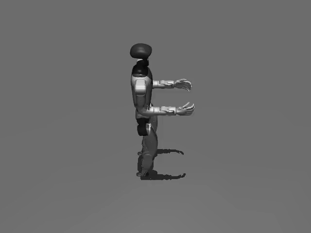

# WBC (Whole-Body-Control)

[`WBCPolicy`](https://github.com/strands-labs/robots/blob/main/strands_robots/policies/wbc/policy.py)
wraps NVIDIA's
[GR00T Whole-Body-Control](https://github.com/NVlabs/GR00T-WholeBodyControl)
(SONIC / decoupled-WBC) ONNX controllers for deploy-grade humanoid locomotion
on the Unitree G1. It runs **in the same process** through ONNX Runtime on CPU:
no sidecar, no network round-trip, no GPU.

It is a non-VLA locomotion controller: it reads its goal from the well-known
locomotion `**kwargs` (`target_velocity`), ignores camera frames
(`requires_images = False`), and never parses the instruction string. It drives
the **15 leg+waist DOFs** of the G1 and holds the arms at their nominal defaults;
to drive the arms as well, layer a manipulation policy on top with
[`CompositePolicy`](#composing-an-upper-body-manipulation-on-top-of-wbc).

## Install

```bash
pip install "strands-robots[wbc]"            # onnxruntime only - light, no torch
pip install "strands-robots[wbc,sim-mujoco]" # + MuJoCo to drive the G1 in sim
```

No weights are bundled and there is no default download: a bare
`create_policy("wbc")` raises instead of fetching the wrong model family. The
decoupled-WBC G1 policies live in the
[`NVlabs/GR00T-WholeBodyControl`](https://github.com/NVlabs/GR00T-WholeBodyControl)
git-LFS tree:

```bash
git clone https://github.com/NVlabs/GR00T-WholeBodyControl.git   # 4.6G LFS
mkdir -p /path/to/grootwbc-g1
cp GR00T-WholeBodyControl/decoupled_wbc/sim2mujoco/resources/robots/g1/policy/\
GR00T-WholeBodyControl-{Balance,Walk}.onnx /path/to/grootwbc-g1/
```

The canonical `GR00T-WholeBodyControl-Balance.onnx` / `-Walk.onnx` filenames are
accepted verbatim; `policy.onnx` / `walk_policy.onnx` also work and take
precedence when both are present:

```text
/path/to/grootwbc-g1/
    GR00T-WholeBodyControl-Balance.onnx   # main (Balance) policy
    GR00T-WholeBodyControl-Walk.onnx      # optional walk policy
    config.json                           # optional
```

The HuggingFace repo [`nvidia/GEAR-SONIC`](https://huggingface.co/nvidia/GEAR-SONIC)
is the SONIC VLA inference stack, **not** this Balance/Walk family; passing it as
a checkpoint raises.

## Quickstart

```python
from strands_robots.policies import create_policy

policy = create_policy(
    "wbc",                                  # shorthand: "sonic"
    checkpoint="/path/to/grootwbc-g1",       # dir with policy.onnx (+ walk_policy.onnx)
    walk=True,
)

actions = policy.get_actions_sync(
    observation_dict={"observation.state": [0.0] * 29},  # G1 joint positions
    instruction="walk forward",             # ignored by the controller
    target_velocity=[0.5, 0.0, 0.0],        # [vx, vy, omega] (m/s, m/s, rad/s)
)
# actions == [{"left_hip_pitch_joint": .., ..., "waist_pitch_joint": ..}]
# one per-tick dict of 15 leg+waist joint targets (closed-loop, not a chunk)
```

`target_velocity` is held to a locomotion envelope of ±2.0 m/s per linear
component and ±2.0 rad/s for `omega`, at the policy and again on the mesh
before dispatch (one definition, `strands_robots.locomotion_envelope`). A
component past it is refused with a reason, never clamped. A faster platform
raises the bound with `STRANDS_MAX_TARGET_LINEAR_VELOCITY_MPS` /
`STRANDS_MAX_TARGET_ANGULAR_VELOCITY_RPS` (positive floats, read on every
call).

## Parameters

```python
WBCPolicy(
    checkpoint="/path/to/grootwbc-g1",  # dir with policy.onnx, a direct .onnx path, or an HF id
    config=None,                       # WBCConfig | path | dict | None (None -> config.json in checkpoint)
    walk=True,                         # load + prefer walk_policy.onnx for locomotion
    target_velocity=None,              # constructor-time default [vx, vy, omega] (per-call kwarg overrides)
    allow_missing_models=False,        # test seam: skip eager ONNX load (inject a stub session)
)
```

A missing `onnxruntime` or a missing checkpoint raises `RuntimeError` at
construction - WBC never falls back to silent zero torques.

`walk` and `allow_missing_models` each select a posture, so both are checked
rather than read by truthiness: a non-boolean raises `ValueError` naming the
parameter. A string such as `"false"` - the spelling a JSON `policy_config`
reaches for - is truthy, and before the check `allow_missing_models="false"`
selected the test seam, skipping the eager load and deferring the missing
checkpoint to the first `get_actions` call.

### Config value domain

`WBCConfig` refuses an unusable *value* at construction, because every numeric
field is read verbatim into the PD law that writes `data.ctrl` or into the
observation, so an unusable one becomes a wrong torque rather than an error:

| Field | Accepted | Why |
|-------|----------|-----|
| `action_scale` | finite `> 0` | The only path from the network to the joint targets. `0` (or `False`) makes `target_q == default_angles`, discarding the policy; a negative value inverts every offset. |
| `kps`, `kds` | finite `>= 0`, per component | `kp = 0` with `kd > 0` is a pure-damping joint and stays valid; a *negative* gain makes `(target_q - q) * kp` drive the joint away from its target. |
| `default_angles`, `cmd_scale`, `rpy_cmd` | finite, per component | Signed quantities (a stance angle, a yaw rate, a roll target), so only finiteness is constrained. |
| `cmd_scale`, `obs_scales` (arity) | stated, or empty to mean the upstream default | An EMPTY `cmd_scale` means "not stated" and is completed with `(2.0, 2.0, 0.5)` at construction, so it cannot scale the velocity differently from omitting the argument. A wrong NON-empty length is still refused by name. |
| `obs_scales` values, `height_cmd`, `freq_cmd` | finite | A non-finite scale poisons the observation frame the network is given. |

A `nan`/`inf` or a `None` anywhere surfaces as a `ValueError` naming the field
and component at construction, not as a non-finite torque mid-rollout.

## Goal kwargs

WBC reads locomotion commands from `**kwargs`, sharing the non-VLA goal
vocabulary so a command can flow through `run_policy` / mesh `tell()` without
coupling to a backend:

| Key | Type | Accepted | Meaning |
|-----|------|----------|---------|
| `target_velocity` | `list[float]` | numeric, >= 3 entries, every component finite | Locomotion command `[vx, vy, omega]` (m/s, m/s, rad/s). Scaled by `cmd_scale` (`[2.0, 2.0, 0.5]`) into the observation's command block. |
| `target_orientation` | `list[float]` | numeric, >= 3 entries, every component finite | Target base `[roll, pitch, yaw]` (rad), written to command slots `[4:7]`. Defaults to the config `rpy_cmd` (`[0,0,0]`). |
| `height` | `float` | finite | Target base height (m), written to command slot `[3]`. Defaults to the config `height_cmd` (`0.74`). |

A per-call `target_velocity` overrides the constructor-time default; with no
command the controller holds a standing balance, and `None` means "not
supplied". `target_velocity` is one of the issue #300 well-known goal keys, so
the mesh path forwards it the same way it forwards a planner's goal:
`mesh.tell(peer, "walk forward", policy_provider="wbc", target_velocity=[0.5, 0.0, 0.0])`.
`target_orientation` and `height` are WBC's own kwargs. Each key keeps the
domain `WBCConfig` enforces for the field it overrides; the vector keys need at
least three components because the command block is zero-initialised, so a
shorter one would silently command zero for an unmentioned axis (a longer one is
truncated).

## Control contract

WBC reproduces the upstream `GearWbcController` loop (NVlabs/GR00T-WholeBodyControl
`decoupled_wbc/sim2mujoco`, `run_mujoco_gear_wbc.py` + `g1_gear_wbc.yaml`):

- **Two ONNX sessions** - `policy.onnx` and an optional `walk_policy.onnx`,
  loaded once. When the **raw** velocity-command norm is `<= 0.05` the main
  (standing) policy runs; above that the walk policy (when `walk=True`).
- **Observation** - an 86-dim frame stacked over `obs_history_len` (default 6,
  network input `86 * 6 = 516`): command `[0:7]` =
  `[vx*2.0, vy*2.0, omega*0.5, height, roll, pitch, yaw]`, base angular velocity
  `[7:10]` (`ang_vel_scale=0.5`), projected gravity `[10:13]`, joint positions
  `[13:28]` (minus `default_angles`, `dof_pos_scale`), joint velocities
  `[28:43]` (`dof_vel_scale=0.05`), previous action `[43:58]`, reserved zero tail
  `[58:86]`. The upstream YAML's flat scale keys are normalised into the nested
  `obs_scales` map, and a config states only the scales it changes; the rest keep
  the upstream defaults. An empty `cmd_scale` means "not stated" and resolves to
  `(2.0, 2.0, 0.5)`, never to a bare `1.0` - which would command a yaw rate
  double the one asked for.
- **Action** - a 15-dim joint-position *offset*; the policy forms
  `target_q = default_angles + action_scale * raw`, keyed by actuator name. For
  torque-actuated MuJoCo, convert with `policy.compute_torques(target, q, dq)`.

## Actuator mapping

WBC output index `i` drives `WBC_G1_LEG_WAIST_JOINTS[i]` - an explicit table.
`set_robot_state_keys` validates that the robot's first 15 joints match this
order and raises otherwise:

```
left_hip_pitch_joint, left_hip_roll_joint, left_hip_yaw_joint,
left_knee_joint, left_ankle_pitch_joint, left_ankle_roll_joint,
right_hip_pitch_joint, right_hip_roll_joint, right_hip_yaw_joint,
right_knee_joint, right_ankle_pitch_joint, right_ankle_roll_joint,
waist_yaw_joint, waist_roll_joint, waist_pitch_joint
```

## In simulation

```python
from strands_robots import Robot

sim = Robot("unitree_g1")             # sim-by-default; CPU ONNX, no GPU needed
sim.run_policy(
    robot_name="unitree_g1",
    instruction="walk forward",       # ignored by the controller
    policy_provider="wbc",
    policy_config={"checkpoint": "/path/to/grootwbc-g1", "walk": True},
    policy_kwargs={"target_velocity": [0.5, 0.0, 0.0]},   # per-call locomotion goal
    duration=10.0,
    control_frequency=50.0,
    action_horizon=1,                 # WBC is closed-loop per tick
)
```

The stock Menagerie G1 ships *position-servo* actuators with a uniform `kp=500`
that overrides SONIC's tuned PD, so writing targets to them directly makes the
robot fall. `run_policy` therefore detects a `WBCPolicy` on a position-servo
scene and installs the torque shim (`WBCTorqueController`, PD->torque) for the
call, restoring the actuators afterwards so a second call behaves like the
first. The shim's `physics_substeps_per_control` (upstream `control_decimation=4`
at 0.005 s = one inference per 20 ms) must be a positive integer, because the
gait clock integrates at the declared period. With the real weights and
`target_velocity = [0.5, 0, 0]` the base advances ~1.9 m over 5 s at pelvis
height ~0.75 m. Opt out to drive a torque scene directly:

```python
sim.run_policy(..., policy_provider="wbc", wbc_install_torque_control=False)
```

A *static* velocity can be set once via
`policy_config={"checkpoint": ..., "target_velocity": [0.5, 0.0, 0.0]}`; that is
also the way to evaluate WBC at a fixed velocity, since `policy_kwargs` is wired
on the control path (`run_policy` / `start_policy` / `tell()`), not on
`eval_policy`.

## Watching it walk (torque-control deploy)

[`examples/wbc/wbc_g1_torque_deploy.py`](https://github.com/strands-labs/robots/blob/main/examples/wbc/wbc_g1_torque_deploy.py)
reproduces the upstream deploy loop directly - torque motors,
`policy.compute_torques(...)` at `control_decimation=4`, whole-body observation
with real joint velocities + base IMU:

```bash
python examples/wbc/wbc_g1_torque_deploy.py --checkpoint /path/to/grootwbc-g1 \
    --duration 5 --vx 0.5 --mp4 /tmp/g1_walk.mp4
```

With the real weights this produces a stable forward walk (~0.38 m/s for a
0.5 m/s command); `--vx 0` holds balance in place.

<figure markdown>
  
  <figcaption>Unitree G1 under <code>WBCPolicy</code> (GR00T-WBC SONIC, <code>walk_policy.onnx</code>)
  commanded at <code>vx = 0.5 m/s</code> — the torque-PD deploy loop in MuJoCo (headless).
  The base advances ~2.3 m over 6 s (~0.38 m/s) while holding pelvis height ~0.75 m and
  staying upright. Produced by <code>examples/wbc/wbc_g1_torque_deploy.py --vx 0.5 --mp4</code>
  (<a href="https://github.com/strands-labs/robots/blob/main/docs/assets/wbc/g1_walk.mp4">MP4</a>).</figcaption>
</figure>

## Composing an upper body (manipulation on top of WBC)

To layer a manipulation policy on the arms while WBC keeps the robot balanced
and walking, wrap both in [`CompositePolicy`](custom-policies.md): the lower
policy owns legs+waist, the upper policy owns the arms, and the composite queries
both each tick and merges their action dicts by joint name.

```python
from strands_robots.policies import CompositePolicy, create_policy
from strands_robots.policies.wbc import WBC_G1_ALL_JOINTS, WBC_G1_LEG_WAIST_JOINTS

ARM_JOINTS = WBC_G1_ALL_JOINTS[len(WBC_G1_LEG_WAIST_JOINTS):]  # the 14 arm DOFs

lower = create_policy("wbc", checkpoint="/path/to/grootwbc-g1")
upper = create_policy("groot", port=5555)        # or pi0 / MolmoAct / any Policy
policy = CompositePolicy(
    lower=lower,
    upper=upper,
    lower_joints=WBC_G1_LEG_WAIST_JOINTS,   # legs + waist
    upper_joints=ARM_JOINTS,                 # both arms
)
```

Each child contributes only its own joint group; a genuine ownership conflict
is raised, never silently resolved, and the merged chunk length is the shorter
of the two so the per-tick controller is never starved. `lower_obs_keys` /
`upper_obs_keys` optionally narrow what each child is queried with, and a subset
sharing no key with the observation is refused - a balance controller reading
nothing runs open-loop. Run the composite like a bare policy; the torque shim is
installed for the `WBCPolicy` inside it (or inside a `PersistentPolicy`) and
runs a light PD (`kp = 100`, `kd = 0.5`) on each arm joint toward the upper
policy's target:

```python
sim.run_policy(
    robot_name="unitree_g1",
    policy_object=policy,
    policy_kwargs={"target_velocity": [0.5, 0.0, 0.0]},
    control_frequency=50.0,
    n_steps=500,
)
```

[`examples/wbc/wbc_g1_composite.py`](https://github.com/strands-labs/robots/blob/main/examples/wbc/wbc_g1_composite.py)
runs the composite in the torque-deploy loop with a scripted arm-wave as the
upper body (`--upper-port` for a real GR00T server):

```bash
python examples/wbc/wbc_g1_composite.py --checkpoint /path/to/grootwbc-g1 \
    --duration 5 --vx 0.4 --mp4 /tmp/g1_composite.mp4
```

<figure markdown>
  
  <figcaption>Unitree G1 under <code>CompositePolicy</code>: <code>WBCPolicy</code> (GR00T-WBC SONIC)
  drives the legs+waist for a <code>vx = 0.4 m/s</code> walk while the upper-body policy drives the
  arms - the base advances ~1.55 m over 5 s while the arms move, in MuJoCo (headless).
  Produced by <code>examples/wbc/wbc_g1_composite.py --vx 0.4 --mp4</code>
  (<a href="https://github.com/strands-labs/robots/blob/main/docs/assets/wbc/g1_composite.mp4">MP4</a>).</figcaption>
</figure>

## Gait-clock variant

NVIDIA's reference repo ships a second G1 controller - a single-policy
**gait-clock** variant (95-dim observation, an 8-wide command with a
`freq_cmd` step-frequency slot, and a 2-dim bipedal phase clock). It is
implemented by `WBCGaitPolicy` (provider `wbc_gait`). See
[WBC gait-clock variant](wbc_gait.md).

## See also

- [Policy overview](overview.md)
- [GR00T](groot.md) - ZMQ service VLA (manipulation upper body).
- [Custom policies](custom-policies.md) - implement the non-VLA goal-kwargs contract.
- [GR00T-WholeBodyControl](https://github.com/NVlabs/GR00T-WholeBodyControl)
