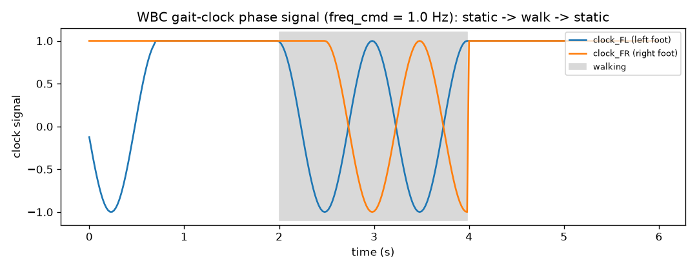

# WBC gait-clock variant

## Gait-clock variant (`WBCGaitPolicy`)

NVIDIA's reference repo ships **two** MuJoCo G1 controllers. The non-gait pair
(`run_mujoco_gear_wbc.py`: 86-dim observation, 7-wide command, a balance
`policy` + a `walk_policy` selected by velocity) is `WBCPolicy` above. The
**gait-clock** variant (`run_mujoco_gear_wbc_gait.py`) is `WBCGaitPolicy`:

- A **single** ONNX policy (no balance/walk split).
- A **95-dim** observation frame, stacked x6 -> a `[batch, 570]` network input.
- An **8-wide command** block with a `freq_cmd` step-frequency slot inserted at
  index 4 (so rpy moves to slots `[5:8]`), set via the `gait_frequency` kwarg.
- A 2-dim **bipedal phase clock** (`[clock_FL, clock_FR]`) appended to each
  frame - the locomotion rhythm the network steps to.

```python
from strands_robots.policies import create_policy

policy = create_policy(
    "wbc_gait",                       # or the "sonic_gait" shorthand
    checkpoint="/path/to/gait-g1",    # a 95x6-input gait ONNX checkpoint
    target_velocity=[0.5, 0.0, 0.0],
    gait_frequency=1.5,               # freq_cmd (steps/s)
)
sim.run_policy(robot_name="unitree_g1", policy_object=policy,
               target_velocity=[0.5, 0.0, 0.0], gait_frequency=1.5,
               duration=5.0, control_frequency=50.0)
```

The shipped `GR00T-WholeBodyControl-Balance.onnx` / `-Walk.onnx` weights are the
*non-gait* 516-wide family and do **not** load into this variant; supply a
gait-clock checkpoint whose ONNX input is `[batch, 570]`.

The new ingredient is the phase clock - a small stateful generator
(`GaitClock`) that turns the velocity command + step frequency into the
left/right-foot phase signal, with a walk-entry reseed, a warm-up ramp, and a
static-stance freeze. It is a verbatim NumPy port of the upstream block (no
torch) and is unit-tested against hand-computed values.
[`examples/wbc_g1_gait.py --plot-clock`](https://github.com/strands-labs/robots/blob/main/examples/wbc_g1_gait.py)
visualizes it through a static -> walk -> static schedule (no checkpoint
needed):

<figure markdown>
  
  <figcaption>The <code>WBCGaitPolicy</code> bipedal phase clock
  (<code>freq_cmd = 1.0</code>): both feet are frozen at the held stance while
  static, then the left/right channels oscillate half a cycle out of phase
  during the walk window, returning to a frozen stance when the command goes
  static again. Produced by <code>examples/wbc_g1_gait.py --plot-clock</code>.</figcaption>
</figure>

