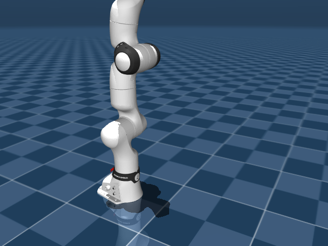
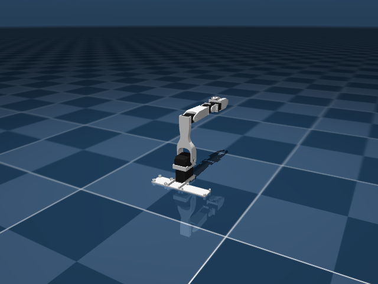
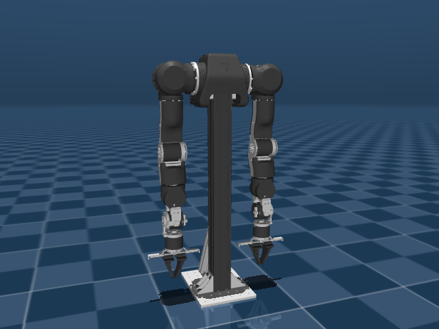
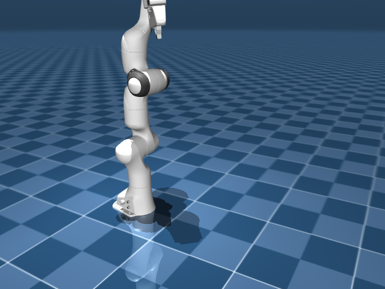
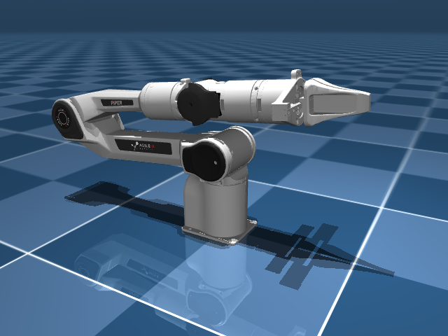

# Arms

Single-arm manipulators: industrial robots, research arms, educational kits.
**22 robots in this category.**

```python
from strands_robots import Robot
sim = Robot("panda")            # Franka Emika Panda
sim = Robot("ur5e")             # Universal Robots UR5e
sim = Robot("so100")            # SO-ARM100 (low-cost Feetech)
```

## Catalog

| Name | Description | Joints | Aliases |
|------|-------------|-------:|---------|
| `arx_l5` | ARX L5 (6-DOF lightweight arm) | 11 | — |
| `dynamixel_2r` | Dynamixel 2R Educational Arm (2-DOF) | 2 | — |
| `fr3` | Franka Research 3 (7-DOF + gripper) | 8 | `franka_fr3` |
| `fr3_v2` | Franka Research 3 v2 (7-DOF + gripper, updated) | 7 | `franka_fr3_v2` |
| `hope_jr` | Hope Junior arm _(hardware-only, no sim asset)_ | ? | — |
| `kinova_gen3` | Kinova Gen3 (7-DOF lightweight) | 7 | — |
| `koch` | Koch v1.1 Low Cost Robot Arm (6-DOF, Dynamixel) | 7 | `koch_follower`, `koch_v1.1`, `low_cost_robot_arm` |
| `kuka_iiwa` | KUKA LBR iiwa 14 (7-DOF collaborative) | 11 | `kuka_iiwa_14` |
| `omx` | OMX Robot Arm (ROBOTIS, CAN bus motors) _(hardware-only, no sim asset)_ | ? | `omx_follower`, `omx_robot`, `robotis_omx` |
| `openarm` | Enactic OpenArm (7-DOF, DAMIAO motors, CAN bus) | 9 | `enactic_openarm`, `open_arm`, `openarm_v10` |
| `panda` | Franka Emika Panda (7-DOF + gripper) | 7 | `bimanual_panda_gripper`, `bimanual_panda_hand`, `franka` |
| `piper` | AgileX Piper (6-DOF + gripper) | 11 | `agilex_piper` |
| `sawyer` | Rethink Robotics Sawyer (7-DOF) | 7 | `rethink_sawyer` |
| `so100` | TrossenRobotics SO-ARM100 (6-DOF, Feetech servos) | 13 | `so100_4cam`, `so100_dualcam`, `so100_follower` |
| `so101` | RobotStudio SO-101 (6-DOF, upgraded SO-100) | 9 | `robotstudio_so101`, `so101_dualcam`, `so101_follower` |
| `ur10e` | Universal Robots UR10e (6-DOF industrial) | 6 | — |
| `ur5e` | Universal Robots UR5e (6-DOF industrial) | 8 | — |
| `vx300s` | Trossen ViperX 300s (6-DOF + gripper) | 19 | `oxe_widowx`, `trossen_vx300s`, `viper_x300s` |
| `wx250s` | Trossen WidowX 250s (6-DOF + gripper) | 16 | `widowx_250s`, `trossen_wx250s` |
| `xarm7` | UFactory xArm 7 (7-DOF + gripper) | 13 | `ufactory_xarm7` |
| `yam` | i2rt YAM Arm (8-DOF) | 8 | `i2rt_yam` |
| `z1` | Unitree Z1 (6-DOF + gripper) | 8 | `unitree_z1` |


## Featured renders

A handful of the arms with their default sim render:

### `arx_l5`

{ width=400 }

_ARX L5 (6-DOF lightweight arm)_

### `fr3`

{ width=400 }

_Franka Research 3 (7-DOF + gripper)_

### `kinova_gen3`

{ width=400 }

_Kinova Gen3 (7-DOF lightweight)_

### `koch`

{ width=400 }

_Koch v1.1 Low Cost Robot Arm (6-DOF, Dynamixel)_

### `kuka_iiwa`

{ width=400 }

_KUKA LBR iiwa 14 (7-DOF collaborative)_

### `openarm`

{ width=400 }

_Enactic OpenArm (7-DOF, DAMIAO motors, CAN bus)_

### `panda`

{ width=400 }

_Franka Emika Panda (7-DOF + gripper)_

### `piper`

{ width=400 }

_AgileX Piper (6-DOF + gripper)_


## Compatibility notes

- Most arms are loadable in MuJoCo via the registry's asset block and pull from
  [robot_descriptions.py](https://github.com/robot-descriptions/robot_descriptions.py)
  on first use. Exceptions: `hope_jr` and `omx` have no MuJoCo sim asset and require
  physical hardware.
- `panda`, `so100`, and `ur5e` are also supported on real hardware via LeRobot. The rest
  are simulation-only at the moment (real-hardware support is a per-robot effort that
  upstreams to LeRobot).
- Joint counts include any free joints / gripper actuators — the *control* DOF is
  usually `joints - 1` for arms with grippers.

## See also

- [Robot factory](../getting-started/robot-factory.md) — how `Robot("name")` resolves
  these names.
- [Bimanual](bimanual.md) — two-arm setups (Aloha, Trossen WX-AI).
- [Hands](hands.md) — pair an arm with a dexterous end-effector.
- [Quickstart](../getting-started/quickstart.md) — spawn one of these arms in 3 lines.
