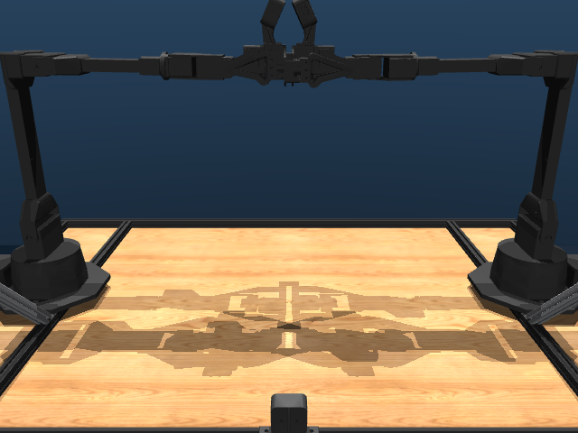

# Bimanual rigs

Two-arm robots - Aloha, Trossen WX-AI, OpenArm bimanual.

```python
from strands_robots import Robot
sim = Robot("aloha")            # Trossen Aloha bimanual
sim = Robot("bi_openarm")       # OpenArm bimanual
sim = Robot("trossen_wxai")     # Trossen WX-AI
```

## Catalog

| Name | Description | Joints | Aliases |
|------|-------------|-------:|---------|
| `aloha` | ALOHA Bimanual (2x ViperX 300s, 14-DOF + 2 grippers) | 28 | `agibot_dual_arm`, `agibot_dual_arm_dexhand`, `agibot_dual_arm_full` |
| `bi_openarm` | Bi-manual OpenArm (dual-arm coordination) _(hardware-only, no sim asset)_ | ? | `bi_openarm_follower`, `dual_openarm`, `openarm_bimanual` |
| `bi_rebot_b601` | Bi-manual reBot B601-DM (dual 6-DOF + gripper, Damiao CAN motors) _(hardware-only, no sim asset)_ | ? | `bi_rebot_b601_follower`, `dual_rebot_b601` |
| `trossen_wxai` | Trossen WidowX AI Bimanual | 17 | `trossen_ai_bimanual` |

## Featured renders

### `aloha`

{ width=400 }

_ALOHA Bimanual (2x ViperX 300s, 14-DOF + 2 grippers)_

### `trossen_wxai`

{ width=400 }

_Trossen WidowX AI Bimanual_

## See also

- [Arms](arms.md) - single-arm manipulators.
- [Hands](hands.md) - dexterous end-effectors to mount on each arm.
- [Multi-robot mesh](../mesh.md) - pair two single arms via the mesh as an alternative to a single bimanual rig.
