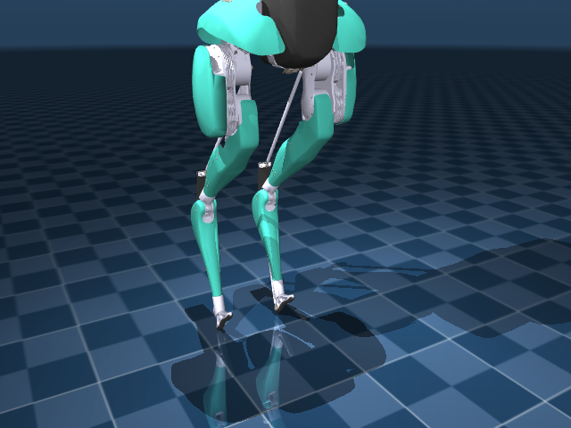
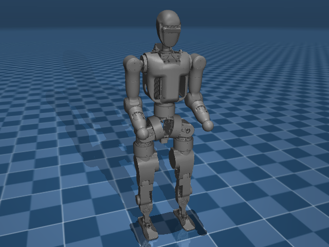
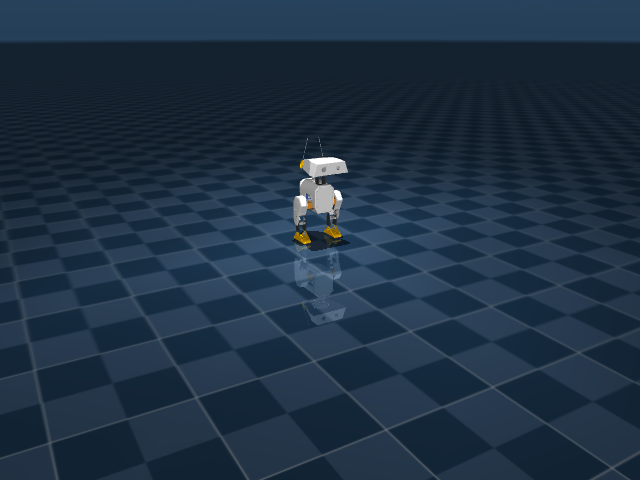
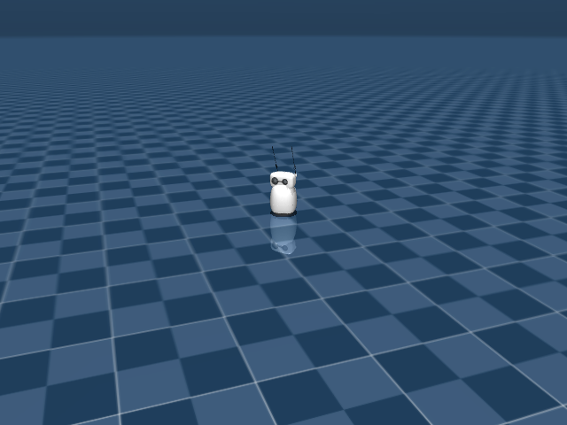

# Humanoids

Full-body humanoids and expressive desktop robots.

```python
from strands_robots import Robot
sim = Robot("unitree_g1")       # Unitree G1
sim = Robot("unitree_h1")       # Unitree H1
sim = Robot("apollo")           # Apptronik Apollo
sim = Robot("reachy_mini")      # Pollen Reachy Mini (expressive)
```

## Catalog

| Name | Description | Joints | Aliases |
|------|-------------|-------:|---------|
| `adam_lite` | PNDbotics Adam Lite Humanoid (26-DOF) | 26 | `pndbotics_adam_lite` |
| `apollo` | Apptronik Apollo Humanoid (34-DOF) | 34 | `apptronik_apollo` |
| `asimov_v0` | Asimov V0 Bipedal Legs (12-DOF + 2 passive toes) | 15 | `asimov` |
| `booster_t1` | Booster T1 Humanoid (24-DOF) | 24 | - |
| `cassie` | Agility Cassie Bipedal Robot | 28 | `agility_cassie` |
| `elf2` | BXI Elf2 Humanoid (25-DOF) | 26 | `bxi_elf2` |
| `fourier_n1` | Fourier N1 / GR-1 Humanoid (26-DOF) | 26 | `fourier_gr1`, `fourier_gr1_arms_only`, `fourier_gr1_arms_waist` |
| `jvrc` | JVRC-1 Humanoid (HRP-based, 45-DOF) | 45 | `jvrc1` |
| `op3` | ROBOTIS OP3 Humanoid (20-DOF) | 21 | `robotis_op3` |
| `open_duck_mini` | Open Duck Mini V2 (16-DOF expressive biped, Feetech servos) | 16 | `bdx`, `mini_bdx`, `open_duck` |
| `rby1` | Rainbow Robotics RB-Y1A Mobile Manipulator (31-DOF) | 31 | `rby1a`, `rainbow_rby1` |
| `reachy2` | Pollen Reachy 2 _(hardware-only, no sim asset)_ | ? | - |
| `reachy_mini` | Pollen Reachy Mini (6-DOF Stewart head + antennas, 9 actuators) | 21 | `pollen_reachy_mini`, `reachy`, `reachy-mini` |
| `talos` | PAL Robotics TALOS Humanoid (32-DOF) | 45 | `pal_talos` |
| `toddlerbot_2xc` | Toddlerbot 2xC Humanoid (45-DOF) | 45 | - |
| `toddlerbot_2xm` | Toddlerbot 2xM Humanoid (45-DOF) | 45 | - |
| `unitree_g1` | Unitree G1 Humanoid (29-DOF + dexterous hands) | 46 | `g1`, `g1_wbc`, `unitree_g1_full_body` |
| `unitree_h1` | Unitree H1 Humanoid (19-DOF) | 20 | `h1` |
| `unitree_h1_2` | Unitree H1-2 Humanoid (52-DOF, with hands) | 52 | `h1_2` |

## Featured renders

### `apollo`

{ width=400 }

_Apptronik Apollo Humanoid (34-DOF)_

### `asimov_v0`

{ width=400 }

_Asimov V0 Bipedal Legs (12-DOF + 2 passive toes)_

### `cassie`

{ width=400 }

_Agility Cassie Bipedal Robot_

### `fourier_n1`

{ width=400 }

_Fourier N1 / GR-1 Humanoid (26-DOF)_

### `open_duck_mini`

{ width=400 }

_Open Duck Mini V2 (16-DOF expressive biped, Feetech servos)_

### `reachy_mini`

{ width=400 }

_Pollen Reachy Mini (6-DOF Stewart head + antennas, 9 actuators)_

## See also

- [Mobile](mobile.md) - quadrupeds and wheeled bases.
- [Bimanual](bimanual.md) - two-arm rigs without the legs.
- [GR00T](../policies/groot.md) - many GR00T data_configs target humanoids.
