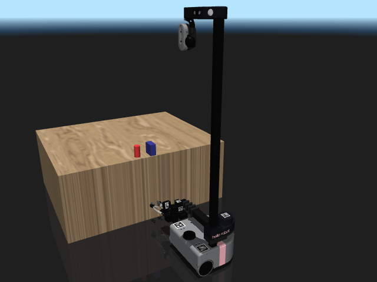

# Mobile, mobile manip, and aerial

Quadrupeds, wheeled bases, mobile manipulators, and quadcopters.

```python
from strands_robots import Robot
sim = Robot("unitree_go2")      # Unitree Go2 quadruped
sim = Robot("spot")             # Boston Dynamics Spot
sim = Robot("stretch3")         # Hello Robot Stretch 3 (mobile manip)
sim = Robot("crazyflie")        # Bitcraze Crazyflie 2 quadcopter
```

## Catalog

| Name | Description | Joints | Aliases |
|------|-------------|-------:|---------|
| `aliengo` | Unitree Aliengo Quadruped (12-DOF) | 13 | `unitree_aliengo` |
| `anymal_b` | ANYbotics ANYmal B Quadruped (12-DOF) | 13 | `anybotics_anymal_b` |
| `anymal_c` | ANYbotics ANYmal C Quadruped (12-DOF) | 13 | `anybotics_anymal_c` |
| `crazyflie` | Bitcraze Crazyflie 2 Nano-Quadcopter | 1 | `cf2`, `bitcraze_crazyflie` |
| `earthrover` | EarthRover Mini Plus (mobile outdoor navigation) _(hardware-only, no sim asset)_ | ? | `earth_rover`, `earthrover_mini_plus`, `frodobots` |
| `go1` | Unitree Go1 Quadruped (12-DOF) | 13 | `unitree_go1` |
| `google_robot` | Google Robot (mobile base + arm, RT-X) | 10 | `oxe_google` |
| `lekiwi` | LeKiwi mobile robot _(hardware-only, no sim asset)_ | ? | — |
| `robot_soccer_kit` | Robot Soccer Kit (multi-robot soccer, 65-DOF total) | 65 | `rsk` |
| `skydio_x2` | Skydio X2 Autonomous Drone | 1 | — |
| `spot` | Boston Dynamics Spot (with arm) | 20 | `boston_dynamics_spot` |
| `stretch` | Hello Robot Stretch (original, mobile manipulator) | 18 | `hello_robot_stretch_original` |
| `stretch3` | Hello Robot Stretch 3 (mobile manipulator) | 41 | `hello_robot_stretch`, `hello_robot_stretch_3` |
| `tiago_dual` | PAL Robotics TIAGo++ Dual-Arm Mobile (26-DOF) | 26 | `tiago++`, `pal_tiago_dual` |
| `unitree_a1` | Unitree A1 Quadruped | 16 | `a1` |
| `unitree_go2` | Unitree Go2 Quadruped | 40 | `go2` |

## Featured renders

### `spot`

{ width=400 }

_Boston Dynamics Spot (with arm)_

### `stretch3`

{ width=400 }

_Hello Robot Stretch 3 (mobile manipulator)_

### `unitree_go2`

{ width=400 }

_Unitree Go2 Quadruped_

## See also

- [Humanoids](humanoids.md) — bipedal alternatives.
- [Multi-robot mesh](../mesh.md) — coordinate a fleet via the mesh.
- [Domain randomization](../simulation/domain-randomization.md) — terrain randomisation for legged robots.
