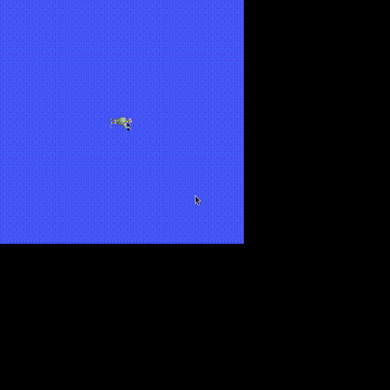

# ROS 2 integration

`use_ros` gives a Strands agent one structured entry point into any ROS 2 graph
reachable from the interpreter - listing and echoing topics, publishing
messages, and calling services - **entirely in-process through `rclpy`**. There
is no `ros2` CLI shelling and no generated-code snippets: every action calls the
ROS 2 client library directly, so message types are real Python classes, errors
are real exceptions, and a single long-lived node/executor is reused across
calls.

```python
from strands import Agent
from strands_robots.tools import use_ros

agent = Agent(tools=[use_ros])
agent("list the ROS 2 topics, then drive /turtle1 forward and confirm its pose changed")
```


*A Strands agent (Claude Opus via Amazon Bedrock) given the `use_ros` tool drives
a real ROS 2 `turtlesim` in a closed-loop square - reading pose, correcting
heading, and re-driving - over 43 in-process `use_ros` calls. See
[`examples/ros2/use_ros/`](https://github.com/strands-labs/robots/tree/main/examples/ros2/use_ros).*

## ROS 2 surfaces at a glance

strands-robots meets ROS 2 from four complementary angles - pick by what you
have and what you want to do:

| Surface | Role | Backend | Needs sourced ROS 2 | Use it to |
|---------|------|---------|---------------------|-----------|
| **`use_ros`** tool | client / observer + commander | in-process `rclpy` | yes | List/echo/publish topics, call services on any ROS 2 graph - full type coverage |
| **`use_rtps`** tool | participant / **act as a robot** | pure `cyclonedds` (pip) | **no** | Join a graph as a DDS peer and publish topics a real stack consumes; works on macOS/CI/Jetson, all distros |
| **`RosBridgedRobot`** | a ROS 2 robot as a strands `Robot` | `use_ros` | yes | `drive()`/`get_pose()` a `cmd_vel`/odom base with the same `Agent(tools=[robot])` UX as sim/hardware |
| **`SimEngine(ros2_bridge=True)`** | the **simulation as a ROS node** | `rclpy` | yes | Publish a running MuJoCo sim's `joint_states` + camera `image_raw` so rviz/nav2/agents can subscribe |
| **`Robot(ros2_bridge=True)`** | a **real robot as a ROS node** (full duplex) | `rclpy` | yes | Publish a physical arm's live `joint_states` + camera `image_raw` so rviz/nav2/agents subscribe to the hardware, **and** subscribe to `joint_command` to drive the arm - symmetric to the sim bridge, plus an inbound command path the sim does not need |

The first three are documented below; the sim bridge has its own section. The
`use_rtps` pure-RTPS path (no rclpy, every ROS 2 distro) is on the
[Pure-RTPS ROS 2](rtps-integration.md) page.

## Requirements

The tool needs `rclpy` and `rosidl_runtime_py` importable in the same
interpreter that runs the agent. These ship with a sourced system ROS 2 distro
and are **not** on PyPI, so they cannot be `pip install`ed and are not pinned in
`pyproject.toml`. Source a ROS 2 environment before launching the agent:

```bash
source /opt/ros/jazzy/setup.bash   # or your distro / RoboStack / conda env
```

When `rclpy` is not importable, every action returns a clear, actionable error
naming the remedy (it never raises). Check the active backend with
`use_ros(action="status")`, which reports either `rclpy (in-process)` or `none`.

The `[ros2]` extra is minimal and optional - it only pulls the pip-installable
`cyclonedds` DDS RMW binding. It does **not** provision ROS 2 by itself; you
still need a real sourced distro.

```bash
pip install 'strands-robots[ros2]'   # optional cyclonedds RMW binding only
```

## Actions

| Action | Required args | Returns |
|--------|---------------|---------|
| `status` | - | Whether the in-process rclpy backend is available |
| `list_topics` | - | Topics with their message types |
| `list_nodes` | - | Node names |
| `list_services` | - | Services with their types |
| `info` | `topic` or `service` | Topic (type + pub/sub counts) or service (type) details |
| `echo` | `topic` (type auto-resolved) | N samples as JSON |
| `publish` | `topic`, `type` | Publishes N messages built from `fields` |
| `service_call` | `service`, `type` | Service response as JSON |

Graph introspection (`list_*`, `info`, `echo` type auto-resolution) uses the
rclpy node API directly (`get_topic_names_and_types`, `get_node_names_and_namespaces`,
`get_service_names_and_types`, `count_publishers`/`count_subscribers`). Message
and service types are resolved dynamically through `rosidl_runtime_py`
(`get_message` / `get_service`), so any interface installed in the ROS 2
environment works with no static registry. Field payloads are plain Python
dicts applied with `set_message_fields` (the standard ROS 2 idiom) - passed
straight to rclpy, never serialised through source, so booleans and `null` are
preserved by construction.

## Examples

```python
use_ros(action="status")
use_ros(action="list_topics")

# Subscribe and read two samples (type auto-resolved from the graph)
use_ros(action="echo", topic="/turtle1/pose", count=2, timeout=2.0)

# Publish a velocity command
use_ros(action="publish", topic="/turtle1/cmd_vel",
        type="geometry_msgs/msg/Twist",
        fields={"linear": {"x": 2.0}, "angular": {"z": 1.5}})

# Call a service with a JSON request
use_ros(action="service_call", service="/spawn",
        type="turtlesim/srv/Spawn",
        fields={"x": 3.0, "y": 3.0, "name": "t2"})
```

## Try it live

A reproducible, one-command showcase drives a real `turtlesim` through every
`use_ros` action (in-process rclpy, closed sense->act->sense loop), and a second
service runs a Strands Agent that draws the square above from a plain-English
prompt:

```bash
cd examples/ros2/use_ros
docker compose run --build --rm showcase   # every action; exits 0 iff the turtle moved
docker compose run --build --rm agent      # a Strands Agent drives a closed-loop square
```

Captured runs are in `examples/ros2/use_ros/sample_output.txt` and
`agent_sample_output.txt`.

## Safety

Agent-supplied topic, service, and type names are validated against an
allowlist before reaching the rclpy graph/type API (alphanumerics plus
`_ / ~ {}` for names; `pkg/msg/Name` or `pkg/srv/Name` for types). Because the
tool never constructs a shell command or generates source, there is no
command-injection or `eval` surface to defend - the validation simply keeps
malformed names from reaching the ROS 2 client library. Backend and timeout
failures are returned as structured `{"status": "error"}` results rather than
raised exceptions.

## Sim bridge: publish a simulation on a ROS 2 domain

The simulator can advertise its own live state on ROS 2. Construct any
`SimEngine` (e.g. `Simulation()`) with `ros2_bridge=True` and it spins up an
internal `rclpy` node that publishes, per robot, after every `step()`:

| Topic | Type | Content |
|-------|------|---------|
| `/<robot>/joint_states` | `sensor_msgs/msg/JointState` | joint names + positions |
| `/<robot>/<camera>/image_raw` | `sensor_msgs/msg/Image` (`rgb8`) | one frame per attached camera |

```python
from strands_robots.simulation import Simulation

sim = Simulation(ros2_bridge=True, ros2_domain=0)
sim.create_world()
sim.add_robot("so101")
sim.step(10)   # publishes /so101/joint_states (+ camera image_raw) on domain 0
```

External ROS 2 nodes - and the agent's own `use_ros` calls - then see the
running simulation:

```bash
ros2 topic list | grep so101          # /so101/joint_states, /so101/<cam>/image_raw
ros2 topic echo /so101/joint_states   # live joint positions, updated every step
```

`rclpy` is an optional, system-provided dependency (the `[ros2]` extra). When it
is missing, `ros2_bridge=True` raises a clear `ImportError` at construction;
`ros2_bridge=False` (the default) never touches ROS 2, so the base sim install
stays lightweight. The bridge node is torn down cleanly on `destroy()`.

See `examples/ros2/sim_bridge_demo.py` for a runnable end-to-end script.

## Hardware bridge: publish a real robot on a ROS 2 domain

The hardware `Robot` is the symmetric counterpart of the sim bridge: construct
it with `ros2_bridge=True` and it owns a
`strands_robots.hardware_ros_bridge.HardwareRosBridge` that advertises the real
arm's live observation on a ROS 2 domain. The sim bridge
(`SimRosBridge`) and the hardware bridge (`HardwareRosBridge`) are thin
subclasses of the same `RosTelemetryBridge`, and the pure-RTPS transport
(`HardwareRtpsBridge`) shares the same wire contract through their common
`RosTelemetryBase`, so a physical arm and its digital twin publish **identical
topics** - a simulated robot and the real one it mirrors are indistinguishable on
the ROS 2 graph:

| Topic | Direction | Type | Content |
|-------|-----------|------|---------|
| `/<robot>/joint_states` | published | `sensor_msgs/msg/JointState` | joint names + positions, every control step |
| `/<robot>/<camera>/image_raw` | published | `sensor_msgs/msg/Image` (`rgb8`) | one frame per camera |
| `/<robot>/joint_command` | **subscribed** | `sensor_msgs/msg/JointState` | inbound `name`/`position` -> `send_action`, drives the real arm |

The first two are **outbound telemetry** (shared, byte-identical, with the sim
bridge). The third is the **inbound command** surface that makes the hardware
bridge *full duplex*: an external ROS 2 node (a teleop joystick node, MoveIt, a
trajectory replayer, or the agent's own `use_ros(action="publish", ...)`) can
publish a `JointState` to `/<robot>/joint_command` and the bridge forwards each
message straight into `Robot.send_action({motor.pos: float})`. Because the
command topic carries the *same* joint names the bridge publishes in
`joint_states`, a controller can echo our names straight back to drive the arm.
The sim sibling does not subscribe - a simulation is driven by its physics
engine; only the real arm is the thing on the graph an external controller can
physically move.

```python
from strands_robots import Robot

# Opt in to the bridge; the arm's observation is mirrored on ROS 2 domain 0.
arm = Robot("so101", mode="real", ros2_bridge=True, ros2_domain=0)

# Each control step of a running task publishes joint_states (+ camera frames).
# Or publish the current observation on demand without starting a task:
arm.publish_ros_observation()                 # joints + cameras
arm.publish_ros_observation(skip_images=True)  # joints only (opt out of cameras)

# Full duplex: with the default ros2_commands=True the bridge also subscribes to
# /so101/joint_command and forwards each message into Robot.send_action, so an
# external ROS 2 node can drive the real arm:
#
#   ros2 topic pub --once /so101/joint_command sensor_msgs/msg/JointState \
#     '{name: ["shoulder_pan.pos", "elbow.pos"], position: [0.1, -0.2]}'
#
# For a read-only telemetry bridge (no inbound control), opt out:
arm_ro = Robot("so101", mode="real", ros2_bridge=True, ros2_commands=False)

# rclpy-free: run the SAME bridge over pure cyclonedds (no sourced ROS 2
# distro). Byte-identical topics; type coverage bounded by the IDL bundle.
arm_rtps = Robot("so101", mode="real", ros2_bridge=True, ros2_transport="rtps")
```

External ROS 2 nodes - rviz, nav2, or the agent's own `use_ros` calls - then see
the physical robot as a live participant:

```bash
ros2 topic list | grep so101          # /so101/joint_states, /so101/<cam>/image_raw
ros2 topic echo /so101/joint_states   # live joint positions from the real arm
```

The bridge is **opt-in**: `ros2_bridge=False` (the default) never touches ROS 2,
so a robot only becomes a ROS 2 device when an operator explicitly asks for it -
the same safety stance as `Robot(mode="sim")` being the default. When `rclpy` is
missing, `ros2_bridge=True` raises a clear `ImportError` at construction. The
inbound command path is on by default (`ros2_commands=True`); set
`ros2_commands=False` for a read-only telemetry bridge that publishes but cannot
be driven. A daemon thread spins the node so inbound commands are serviced
concurrently with publishing, and it is torn down cleanly on `cleanup()`/`stop()`.

See `examples/ros2/hardware_bridge_demo.py` for a runnable end-to-end script.


The frame above was rendered for an SO-101, published on `/so101/wrist/image_raw` by `HardwareRosBridge` over real DDS, and decoded back by a separate `rclpy` subscriber - byte-identical round trip. On the same run `ros2 topic echo /so101/joint_states` returns the live joint vector, so the robot is a first-class ROS 2 device on the graph.

## Mesh bridge: a ROS 2 robot as a first-class strands Robot

`use_ros` is the low-level surface. For mobile bases that expose the usual
`cmd_vel` / odometry / scan topic trio, `RosBridgedRobot` wraps that wiring so a
remote ROS 2 robot drives like any other strands robot - the same
`Agent(tools=[robot])` pattern used for simulated and hardware arms.

```python
from strands import Agent
from strands_robots.mesh import RosBridgedRobot

turtle = RosBridgedRobot.from_ros(
    node_name="turtlesim",
    cmd_vel_topic="/turtle1/cmd_vel",
    odom_topic="/turtle1/pose",
    odom_type="turtlesim/msg/Pose",  # optional; auto-resolved when omitted
)

# Direct, programmatic control:
turtle.drive(linear=1.0, duration=1.5)   # hold the command for 1.5 s
print(turtle.get_pose())                 # one odom/pose sample
turtle.stop()

# Or hand the robot to an agent - its capabilities become named tools
# (drive_turtlesim, get_pose_turtlesim, ...):
agent = Agent(tools=turtle.tools)
agent("drive forward for two seconds, then tell me the pose")
```

The bridge is intentionally thin: every method forwards to `use_ros`, so it
inherits the same in-process rclpy backend and input validation. Construct it
freely without a ROS 2 environment present - errors surface only when a method
is actually called and `rclpy` is unavailable.

| Method | ROS 2 action | Notes |
|--------|--------------|-------|
| `drive(linear, angular, duration=, count=)` | publish `Twist` to `cmd_vel_topic` | `duration` holds the command at `publish_rate` Hz |
| `stop()` | publish zero `Twist` | |
| `get_pose()` | echo `odom_topic` | |
| `get_scan()` | echo `scan_topic` | error when no `scan_topic` configured |
| `.tools` | - | per-instance named agent tools |

See `examples/ros2/turtlebot_demo.py` for an end-to-end agent driving a turtle
in `turtlesim` through the mesh bridge.



The trail above is a turtle in `turtlesim` driven entirely through
`RosBridgedRobot.drive(...)` - the velocity commands are published over ROS 2 by
the mesh bridge, and the pose is read back through the same bridge.
