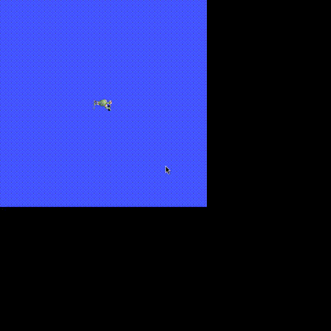

# Mesh bridge: a ROS 2 robot as a first-class strands Robot


`use_ros` is the low-level surface. For mobile bases that expose the usual
`cmd_vel` / odometry / scan topic trio, `RosBridgedRobot` wraps that wiring so a
remote ROS 2 robot drives like any other strands robot - the same
`Agent(tools=[robot])` pattern used for simulated and hardware arms.

```python
import os

from strands import Agent
from strands_robots.mesh import RosBridgedRobot

turtle = RosBridgedRobot.from_ros(
    node_name="turtlesim",
    cmd_vel_topic="/turtle1/cmd_vel",
    odom_topic="/turtle1/pose",
    odom_type="turtlesim/msg/Pose",  # optional; auto-resolved when omitted
)

# Direct, programmatic control. cmd_vel is a gated command surface and a script
# has no operator to prompt, so pre-approve the topics this process drives:
os.environ["STRANDS_ROS2_COMMAND_ALLOW"] = "/turtle1/cmd_vel"
turtle.drive(linear=1.0, duration=1.5)   # hold the command for 1.5 s
print(turtle.get_pose())                 # reads are never gated
turtle.stop()

# Or hand the robot to an agent - its capabilities become named tools
# (drive_turtlesim, stop_turtlesim, get_pose_turtlesim, ...):
agent = Agent(tools=turtle.tools)
agent("drive forward for two seconds, then tell me the pose")
```

The bridge is intentionally thin: every method forwards through the same
transport `use_ros` does (`strands_robots.ros`), so it inherits the same
in-process rclpy backend and its topic/type validation - and a `cmd_vel` command
reaches the shared operator gate whichever of the two asked, under one label: an
approval or a refusal means the same thing on both. The parameters the transport
never sees are checked by the bridge itself - `drive`
reports an error result without publishing when a velocity is not finite, a
`duration` is not positive and finite, or a message `count` is not a positive
whole number, and `publish_rate` is refused at construction. Construct it freely
without a ROS 2 environment present - errors surface only when a method is
actually called and `rclpy` is unavailable.

It also inherits the [command gate](safety.md#safety-critical-command-surfaces-need-operator-approval):
`cmd_vel` and a Nav2 `nav_action` are both blocklisted surfaces. The command
tools forward the operator context they are given, so an agent prompts; a
programmatic call needs `STRANDS_ROS2_COMMAND_ALLOW` (or
`BYPASS_TOOL_CONSENT=true`). That includes `stop()` - the gate is keyed on the
surface rather than the payload, because "zero is harmless" is true of a `Twist`
and false of `/joint_command`, where zero commands motion to the zero pose. An
unattended deployment that must always be able to halt should pre-approve its
`cmd_vel` topic.

| Method | ROS 2 action | Notes |
|--------|--------------|-------|
| `drive(linear, angular, duration=, count=)` | publish `Twist` to `cmd_vel_topic` | `duration` holds the command at `publish_rate` Hz; finite velocities, `duration > 0`, `count >= 1` - anything else is refused without publishing. Gated: needs an operator context or a pre-approved surface |
| `stop()` | publish zero `Twist` | Gated like `drive` - same surface, same verb |
| `navigate_to(x, y, yaw=, frame_id=, timeout=)` | `action_send_goal` to `nav_action` | error when no `nav_action` configured; finite pose components. Gated |
| `get_pose()` | echo `odom_topic` | never gated |
| `get_scan()` | echo `scan_topic` | error when no `scan_topic` configured; never gated |
| `.tools` | - | per-instance named agent tools; the command tools are `@tool(context=True)` so the gate can prompt |

### The shared mobile-base contract

`RosBridgedRobot` is a thin subclass of `MobileBaseRobot`, which owns the drive
contract, the safety semantics and the `tools` property for **every** mobile
robot in `strands_robots.mesh`. A robot class supplies only what actually
varies: a `Transport` (how bytes move) and, when the platform is not
differential-drive, a `_cmd_fields` override (what the command message looks
like).

Everything below therefore holds identically for any transport:

- Non-finite `linear` / `angular` / `duration` are refused. `nan` passes
  silently through a `min`/`max` clamp, so it has to be caught before clamping.
  The accepted domain is the shared one used by every other numeric knob in the
  package, so a velocity and a control-loop frequency agree on what a usable
  number is - a NumPy scalar from a policy action is accepted, a `bool` is not.
- `count` is the publish horizon when no `duration` is given, and must be a
  positive whole number. `count=0` would otherwise publish nothing and report
  success - a drive the caller believes happened. A `count` a call never reads
  (because `duration` supersedes it) is not refused.
- `duration` must be positive and finite, and within `max_duration` when the
  platform sets one. An over-long hold is refused, never silently truncated -
  and refused *before* any side effect, so an invalid request cannot be what
  arms a vehicle.
- Velocities are clamped to `max_linear` / `max_angular` when set. Left unset
  they mean "this platform declares no limit", not zero.
- Every timed or multi-message non-zero command is followed by a single zero
  command, through `try`/`finally`, **even when the publish raised**. A timed
  drive cannot leave a robot with a live velocity.
- A bare single-shot `drive()` latches until `stop()`, exactly like a raw
  `cmd_vel` publish. This is stated in the agent-facing tool description rather
  than hidden.
- `stop()` reaches the transport tool's command gate exactly as `drive()` does.
  The gate is keyed on the *surface*, and zero means "stationary" on a `Twist`
  but commands motion to the zero pose on a joint-command topic, so a
  payload-shaped carve-out could not be written correctly. What the halt does not
  depend on is the enable handshake or the speed limits: an emergency stop must
  not require a working service graph.
- Command tools are declared `@tool(context=True)` by the base and forward the
  injected operator context to the transport, which hands it to its own tool. A
  transport whose tool gates its command surface therefore prompts rather than
  failing closed. All three graph tools gate their command surface today, so no
  shipped transport is exempt - the rule is keyed on the tool rather than on a
  list so that a future ungated one is handled, not because an exemption exists.
  Because the tools are declared once, this holds for every transport rather
  than being wired per bridge.
- `init_services` declares an ordered enable/arm handshake that runs once before
  the first command. It does not latch on failure, so a retry re-runs it. It
  requires a transport that can call services, and is refused at construction on
  one that cannot.

Capabilities are reported, not assumed: `get_pose` appears only with an
`odom_topic`, `get_scan` only with a `scan_topic`, `navigate` only with a
`nav_action`, so an agent is never handed a tool that can only answer "not
configured". `robot.supports("service_call")` asks the transport directly.

See `examples/ros2/turtlebot_demo.py` for an end-to-end agent driving a turtle
in `turtlesim` through the mesh bridge.



The trail above is a turtle in `turtlesim` driven entirely through
`RosBridgedRobot.drive(...)` - the velocity commands are published over ROS 2 by
the mesh bridge, and the pose is read back through the same bridge.
