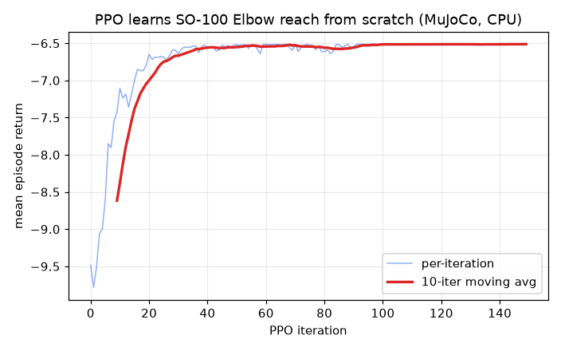
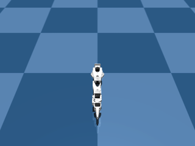
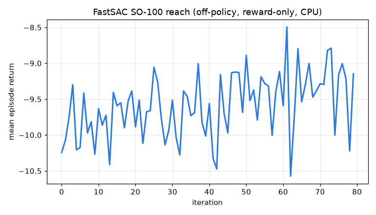
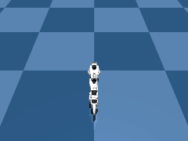

# Reinforcement learning (from scratch)

The [`Trainer`](overview.md) family post-tunes a policy *from a dataset*.
Reinforcement learning is the other half: train a policy *from a reward
function* by interacting with a simulation, with no demonstration data. This is
the only path to a locomotion / whole-body-control policy where no expert
trajectories exist.

RL trainers live in `strands_robots.training.rl` and are selected through the
**same** `create_trainer` factory:

```python
from strands_robots.training import create_trainer
from strands_robots.training.rl import RLTrainSpec

trainer = create_trainer("ppo")   # on-policy PPO, from-scratch RL
```

## The pieces

| Component | Role |
|---|---|
| [`BaseRLAlgo`](#baserlalgo) | Abstract RL trainer; peer of supervised `Trainer`. Lifecycle `setup -> collect_rollout -> update -> save_checkpoint`. |
| [`RLTrainSpec`](#rltrainspec) | Reward-driven training spec (extends `TrainSpec`). |
| [`PpoTrainer`](#ppo) | Proximal Policy Optimization (on-policy, GAE, clipped surrogate + value). |
| [`FastSacTrainer`](#fastsac) | Soft Actor-Critic (off-policy, replay buffer, twin Q critics, auto-tuned entropy). |
| `SimpleReplayBuffer` | Off-policy transition store (fixed-capacity ring buffer). |
| [`SimEnv`](#simenv) | Gym-style `reset -> step` adapter over a `SimEngine`. |
| `EmpiricalNormalization` | Running observation normalizer (whitens inputs for stable training). |

## SimEnv

`SimEnv` wraps a `SimEngine` into the `reset -> step` contract, building the
observation vector from named `get_observation` keys and the step reward from
any reward terms you pass (each a `Callable[[SimEngine], float]`). It uses the holosoma
`actor_obs_keys` / `critic_obs_keys` split: the actor sees only deployable
observations, while the critic may additionally see privileged simulation-only
keys (asymmetric actor-critic).

```python
import strands_robots as sr
from strands_robots.training.rl import SimEnv

TARGET = 0.2

def elbow_reach_reward(engine) -> float:        # a RewardTerm = SimEngine -> float
    elbow = engine.get_observation(skip_images=True)["Elbow"]
    return -abs(float(elbow) - TARGET)

def make_env() -> SimEnv:
    engine = sr.Robot("so100", mode="sim")
    return SimEnv(
        engine,
        actor_obs_keys=["Elbow", "Elbow.vel"],   # what the policy sees
        reward_terms=[elbow_reach_reward],        # dense reward
        action_dim=6,
        max_episode_steps=50,
    )
```

## PPO

```python
from strands_robots.training import create_trainer
from strands_robots.training.rl import RLTrainSpec

trainer = create_trainer("ppo")
spec = RLTrainSpec(
    env_factory=make_env,          # a zero-arg callable returning a SimEnv
    output_dir="/tmp/ppo_reach",
    total_timesteps=250 * 150,
    rollout_steps=250,             # on-policy batch horizon per update
    num_mini_batches=4,
    num_learning_epochs=5,
    learning_rate=1e-3,
    gamma=0.99, lam=0.95, clip_param=0.2,
    init_noise_std=0.8,
    seed=0,
)

problems = trainer.validate(spec)  # pure preflight (no side effects)
assert not problems
result = trainer.train(spec)       # setup -> (collect_rollout -> update)* -> save
print(result.metrics)              # mean_reward, mean_episode_return, surrogate_loss, value_loss
```

`train()` writes a checkpoint under `output_dir/checkpoints/last/`:

- `policy.pt` - the actor-critic + observation-normalizer state (the loadable
  artifact returned by `result.exported_model`).
- `policy_meta.json` - deployable-policy metadata: `num_actions`,
  `actor_obs_keys`, `joint_names`, `hidden_dims`.

`PpoTrainer` trains fine on CPU (its `hardware_floor` declares no GPU
requirement); MuJoCo stepping dominates, not the network.

### Device selection

The learner (actor-critic, normalizers, rollout buffers) is placed on
`RLTrainSpec.device`, defaulting to `cuda` when available and `cpu` otherwise.
The learner device is authoritative: on a GPU host `setup()` reconciles the
`SimEnv` onto it so observations, rewards, and dones are built on the same
device as the network (no cross-device tensor mismatch and no per-step
host-to-device copies). Pass `device="cpu"` explicitly to keep everything on
CPU even on a GPU machine.

## FastSAC

`FastSacTrainer` is the **off-policy** trainer: it keeps a replay buffer of past
transitions and reuses each one across many gradient steps, so it reaches a
target in far fewer environment steps than on-policy PPO (at the cost of more
compute per step). It trains a tanh-squashed Gaussian actor and twin Q critics
(clipped double-Q) with Polyak-averaged target critics and an automatically
tuned entropy temperature, and writes the **same** `policy.pt` +
`policy_meta.json` checkpoint as PPO.

```python
from strands_robots.training import create_trainer
from strands_robots.training.rl import RLTrainSpec

trainer = create_trainer("fast_sac")
spec = RLTrainSpec(
    env_factory=make_env,          # same SimEnv contract as PPO
    output_dir="/tmp/fastsac_reach",
    total_timesteps=50 * 80,
    rollout_steps=50,              # env steps collected per iteration
    learning_starts=500,           # random-action warmup before the first update
    batch_size=256,                # transitions sampled per gradient step
    gradient_steps=50,             # SAC updates per iteration
    buffer_size=50_000,            # replay-buffer capacity
    learning_rate=3e-4,
    gamma=0.99, tau=0.01,          # discount + Polyak target-critic coefficient
    seed=0,
)
result = trainer.train(spec)       # setup -> (collect_rollout -> update)* -> save
print(result.metrics)              # mean_reward, critic_loss, actor_loss, alpha, entropy
```

The off-policy fields on `RLTrainSpec` (`buffer_size`, `batch_size`,
`learning_starts`, `gradient_steps`, `tau`, `autotune_alpha`, `init_alpha`,
`alpha_lr`, `target_entropy`) are read only by SAC; on-policy PPO ignores them.
`target_entropy` defaults to `-num_actions` (the SAC heuristic) when left
`None`. Like PPO, `FastSacTrainer` trains fine on CPU.

## BaseRLAlgo

`BaseRLAlgo` is the abstract RL trainer - a `Trainer` subclass, so RL flows
through the same `create_trainer` / `validate` / `export` contract while adding
the RL lifecycle hooks `setup`, `collect_rollout`, `update`, and
`save_checkpoint`. The default `train()` runs the standard on-policy loop over
those hooks; an off-policy algorithm overrides `train()` with a replay-buffer
loop while keeping the same hooks and checkpoint format.

## RLTrainSpec

`RLTrainSpec` extends `TrainSpec`. RL ignores the dataset fields
(`dataset_root` etc.) and reads `env_factory`, `total_timesteps`,
`rollout_steps`, `num_envs`, the PPO hyperparameters (`gamma`, `lam`,
`clip_param`, `num_learning_epochs`, `num_mini_batches`, `entropy_coef`,
`value_loss_coef`, `max_grad_norm`, `hidden_dims`, `init_noise_std`), the
off-policy SAC fields (`buffer_size`, `batch_size`, `learning_starts`,
`gradient_steps`, `tau`, `autotune_alpha`, `init_alpha`, `alpha_lr`,
`target_entropy`), plus the universal `output_dir` / `learning_rate` / `seed`.

## Worked example

`examples/train_ppo_reach.py` (on-policy) and `examples/train_fastsac_reach.py`
(off-policy) both train the SO-100 `Elbow` joint to a target angle in MuJoCo
from scratch and print the resulting checkpoint path. The MuJoCo backend is
single-environment (`num_envs == 1`); vectorized backends for
massively-parallel rollouts are tracked separately.


## Result

PPO trained from scratch on CPU (no dataset, reward only) closes the reach
gap over 150 iterations and the deterministic policy drives the `Elbow` joint
to the target:





FastSAC (off-policy) reaches the same target in far fewer environment steps,
reusing replayed transitions; the deterministic policy drives the `Elbow`
joint onto the target (0.19 rad vs. a 0.20 target):




