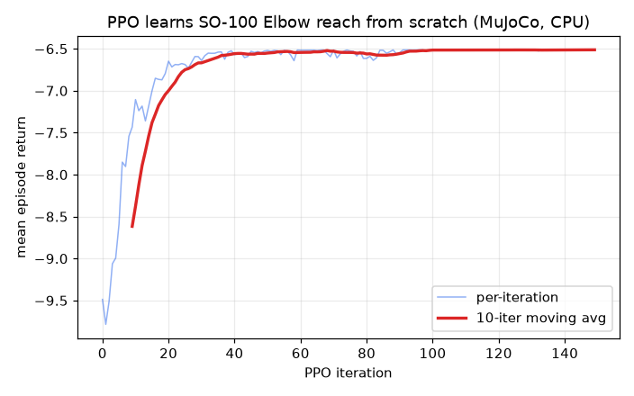
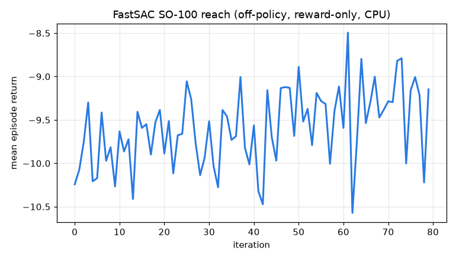

# Reinforcement learning (from scratch)

The [`Trainer`](overview.md) family post-tunes a policy *from a dataset*.
Reinforcement learning is the other half: train from a *reward function* by
interacting with a simulation, with no demonstration data - the only path to a
locomotion or whole-body-control policy where no expert trajectories exist.

RL trainers live in `strands_robots.training.rl` and are selected through the
**same** `create_trainer` factory. They compute in torch and step a MuJoCo
`SimEngine`, so install the `[rl]` extra first (it folds `[sim-mujoco]` in, and
`gymnasium` for the `GymSimEnv` wrapper):

```bash
pip install 'strands-robots[rl]'
```

## The pieces

| Component | Role |
|---|---|
| [`BaseRLAlgo`](rl-reference.md#baserlalgo) | Abstract RL trainer; peer of supervised `Trainer`. Lifecycle `setup -> collect_rollout -> update -> save_checkpoint`. |
| [`RLTrainSpec`](rl-reference.md#rltrainspec) | Reward-driven training spec (extends `TrainSpec`). |
| [`PpoTrainer`](#ppo) | Proximal Policy Optimization (on-policy, GAE, clipped surrogate + value). |
| [`FastSacTrainer`](#fastsac) | Soft Actor-Critic (off-policy, replay buffer, twin Q critics, auto-tuned entropy). |
| `SimpleReplayBuffer` | Off-policy transition store (fixed-capacity ring buffer). |
| [`SimEnv`](#simenv) | Gym-style `reset -> step` adapter over a `SimEngine`. |
| `EmpiricalNormalization` | Running observation normalizer; statistics update in training mode only, so `eval()` makes an exported policy whiten deterministically. Both `forward` and `update` want a batched `(batch, num_obs)` tensor - pass `obs.unsqueeze(0)` for one observation. |

## SimEnv

`SimEnv` wraps a `SimEngine` into the `reset -> step` contract, building the
observation from named `get_observation` keys and the reward from the terms you
pass (each a `Callable[[SimEngine], float]`). The actor sees only deployable
observations; the critic may additionally see privileged sim-only keys
(asymmetric actor-critic). Its observation is `actor_obs_keys` plus each
`critic_obs_keys` entry not already among them, so a privileged key adds rather
than replaces, a repeat adds nothing, and `None` or `[]` keeps the critic
symmetric.

```python
import strands_robots as sr
from strands_robots.training.rl import SimEnv

TARGET = 0.2

def elbow_reach_reward(engine) -> float:        # a RewardTerm = SimEngine -> float
    elbow = engine.get_observation(skip_images=True)["Elbow"]
    return -abs(float(elbow) - TARGET)

def make_env() -> SimEnv:
    engine = sr.Robot("so100", mode="sim")
    return SimEnv(
        engine,
        actor_obs_keys=["Elbow", "Elbow.vel"],   # what the deployed policy sees
        critic_obs_keys=["Jaw"],                 # privileged, sim-only, additional
        reward_terms=[elbow_reach_reward],        # dense reward
        action_dim=6,
        max_episode_steps=50,
    )
```

That env has `critic_obs_keys == ["Elbow", "Elbow.vel", "Jaw"]` -
`num_actor_obs == 2`, `num_critic_obs == 3`. Every numeric argument is graded at
construction; [the reference](rl-reference.md#simenv-numeric-arguments) states
each domain.

## PPO

```python
from strands_robots.training import create_trainer
from strands_robots.training.rl import RLTrainSpec

trainer = create_trainer("ppo")
spec = RLTrainSpec(
    env_factory=make_env,          # a zero-arg callable returning a SimEnv
    output_dir="/tmp/ppo_reach",
    total_timesteps=250 * 150,
    rollout_steps=250,             # on-policy batch horizon per update
    num_mini_batches=4,
    num_learning_epochs=5,
    learning_rate=1e-3,
    gamma=0.99, lam=0.95, clip_param=0.2,
    init_noise_std=0.8,
    seed=0,
)

problems = trainer.validate(spec)  # pure preflight (no side effects)
assert not problems
result = trainer.train(spec)       # setup -> (collect_rollout -> update)* -> save
print(result.metrics)              # mean_reward, mean_episode_return, surrogate_loss, value_loss
```

`train()` writes a checkpoint under `output_dir/checkpoints/last/`: `policy.pt`
(actor-critic + observation-normalizer state, returned as
`result.exported_model`) and `policy_meta.json` (`num_actions`,
`actor_obs_keys`, `action_keys`, `hidden_dims`).

`action_keys` names what the `num_actions` outputs drive, in order: the robot's
`robot_action_keys`, the vocabulary `send_action` binds against - not the joint
list. A tendon-driven gripper is one actuator over two finger joints (a Panda
has 9 joints, 8 action keys), and the Newton backend's floating base is a joint
with no commandable scalar. `SimEnv` sizes `num_actions` from that same list, so
`len(action_keys) == num_actions` always holds. `validate(spec)` grades every
field before `setup()` builds anything - see
[`RLTrainSpec`](rl-reference.md#rltrainspec).

### Deploying the checkpoint

`create_policy("rl", checkpoint_dir=...)` presents the trained actor as an
ordinary [`Policy`](../policies/rl.md), so it drives a robot through the same
`run_policy` / `eval_policy` path as every other provider:

```python
result = create_trainer("ppo").train(spec)

sim = sr.Robot("so100", mode="sim")     # the robot make_env trained on
sim.run_policy(
    robot_name="so100",
    policy_provider="rl",
    policy_config={"checkpoint_dir": result.checkpoint_dir},
    duration=10.0,
)
```

The provider reads `provider` to rebuild the right architecture, binds
`actor_obs_keys` by name in the trained order, and restores the normalizer
frozen. For a custom loop,
`strands_robots.training.rl.load_deployable_actor(checkpoint_dir)` returns a
`DeployableActor` whose `act(obs)` is the deterministic command.

## FastSAC

`FastSacTrainer` is the **off-policy** trainer: it replays past transitions
across many gradient steps, reaching a target in far fewer environment steps
than PPO at more compute per step. It trains a tanh-squashed Gaussian actor and
twin Q critics (clipped double-Q) with Polyak-averaged targets and an auto-tuned
entropy temperature, and writes the **same** checkpoint pair as PPO.

```python
trainer = create_trainer("fast_sac")
spec = RLTrainSpec(
    env_factory=make_env,          # same SimEnv contract as PPO
    output_dir="/tmp/fastsac_reach",
    total_timesteps=50 * 80,
    rollout_steps=50,              # env steps collected per iteration
    learning_starts=500,           # random-action warmup before the first update
    batch_size=256,                # transitions sampled per gradient step
    gradient_steps=50,             # SAC updates per iteration
    buffer_size=50_000,            # replay-buffer capacity
    learning_rate=3e-4,
    gamma=0.99, tau=0.01,          # discount + Polyak target-critic coefficient
    seed=0,
)
result = trainer.train(spec)       # setup -> (collect_rollout -> update)* -> save
print(result.metrics)              # mean_reward, critic_loss, actor_loss, alpha, entropy
```

The off-policy fields (`buffer_size`, `batch_size`, `learning_starts`,
`gradient_steps`, `tau`, `autotune_alpha`, `init_alpha`, `alpha_lr`,
`target_entropy`) are read only by SAC; PPO ignores them. `target_entropy`
defaults to `-num_actions` when left `None`.

The learner and the environment share one device, chosen by
[`RLTrainSpec.device`](rl-reference.md#device-selection); both trainers train
fine on CPU, where MuJoCo stepping dominates.

## Worked example

`examples/training/train_ppo_reach.py` (on-policy) and
`examples/training/train_fastsac_reach.py` (off-policy) both train the SO-100
`Elbow` joint to a target angle in MuJoCo from scratch and print the checkpoint
path. The MuJoCo backend is single-environment (`num_envs == 1`).

## Result

PPO from scratch on CPU (no dataset, reward only) closes the reach gap over 150
iterations, and the deterministic policy drives the `Elbow` joint to the target:




FastSAC reaches the same target in far fewer environment steps by replaying
transitions (0.19 rad against a 0.20 target):




## See also

- [RL API reference](rl-reference.md) - `SimEnv` argument domains, the
  `BaseRLAlgo` lifecycle, `evaluate()`, and every `RLTrainSpec` field.
- [RL Checkpoint policy](../policies/rl.md) - rolling a trained actor out.
