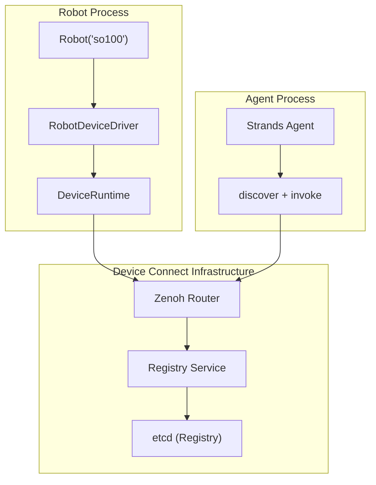
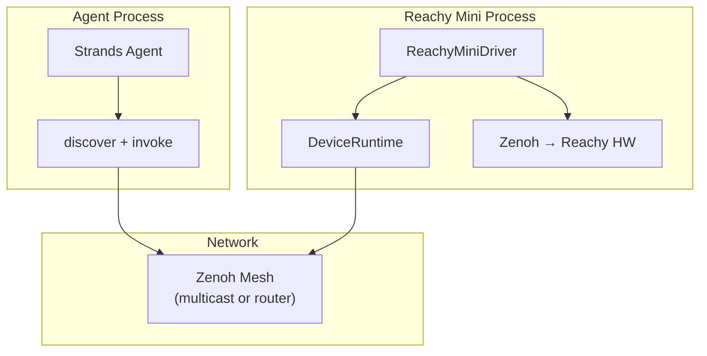

# Device Connect Integration

Strands Robots uses [Device Connect](https://github.com/arm/device-connect), a **device-aware runtime** by Arm - to handle discovery, presence, structured RPC, event routing, and safety - so you can focus on building cross-device experiences instead of re-implementing infrastructure.

> **Fallback behavior:** If `device-connect-edge` is not installed, Strands Robots automatically falls back to a built-in Zenoh P2P mesh (`zenoh_mesh.py`) for basic peer discovery and coordination. Device Connect is the recommended and primary networking layer.

### Quick Start

```python
from strands_robots import Robot

r = Robot("so100")
r.run()  # starts listening for commands. Ctrl+C to stop.
```

`Robot()` creates the robot. `.run()` starts Device Connect with D2D defaults (Zenoh multicast scouting, no broker) and blocks - the robot becomes discoverable on the LAN and listens for commands. Without `.run()`, the script exits and the robot is removed from the network.

> **Secure by default:** Device Connect no longer enables unencrypted/unauthenticated transport implicitly. For a local, trusted-network D2D trial without a broker, explicitly opt in to insecure transport:
> ```bash
> export DEVICE_CONNECT_ALLOW_INSECURE=true   # ONLY on a trusted, isolated LAN
> ```
> A prominent warning is logged whenever insecure mode is active. For anything beyond a local trial, run the brokered/registry setup with mTLS (see *Full Infrastructure* below).

You can optionally pass `peer_id="so100-lab-1"` for a stable address; otherwise one is auto-generated (e.g. `so100-a3f1b2`).

**Robot lifecycle:**

| Pattern | Behavior |
|---|---|
| `r = Robot("so100"); r.run()` | **Option A - Foreground server.** Process stays alive, listens for commands. Ctrl+C to stop. |
| `r = Robot("so100")` | **Option B - Agent-controlled.** A Strands Agent discovers the robot via `robot_mesh` or `discover()` and invokes commands remotely. |

From another process, discover and invoke:

```python
from strands_robots.tools.robot_mesh import robot_mesh

robot_mesh(action="peers")                           # discover (read-only)
robot_mesh(action="tell", target="so100-lab-1",      # invoke (HITL-approved)
           instruction="pick up the cube")
robot_mesh(action="emergency_stop")                   # e-stop all (HITL-approved)
```

> **Heads up:** the actuation actions - `tell`, `send`, `stop`, `broadcast`,
> `emergency_stop`, and `rpc` - are gated behind a human-in-the-loop approval, so
> they run only from inside a Strands agent loop (where the operator approves).
> Called from a bare script they **fail closed**. Read-only `peers` works
> anywhere. The gated set is configurable via `STRANDS_MESH_HITL_ACTIONS`.

### Architecture



### E2E Demo

No Docker needed. Devices discover each other directly on the LAN via Zenoh multicast scouting. `Robot()` and `robot_mesh()` auto-configure D2D mode when no broker URL is set.

> **Secure by default:** for this local D2D trial, opt into insecure transport on every terminal first (trusted/isolated LAN only):
> ```bash
> export DEVICE_CONNECT_ALLOW_INSECURE=true
> ```

#### Setup

##### 1. Install

> `setup.sh` installs `uv`, Python 3.12, creates a venv, and installs all dependencies.

```bash
git clone https://github.com/strands-labs/robots.git
cd robots
./strands_robots/device_connect/setup.sh
source .venv/bin/activate
```

##### 2. Start a robot

```bash
screen -S robot                        # start a persistent session
python -c "
from strands_robots import Robot
r = Robot('so100')
r.run()
"
# once online, Ctrl+a then d to detach
# screen -ls to list sessions
# screen -r robot to reattach
```

Expected output:

```
device_connect_edge.device.<PEER_ID> - INFO - Using ZENOH messaging backend
device_connect_edge.device.<PEER_ID> - INFO - Connected to ZENOH broker: []
device_connect_edge.device.<PEER_ID> - INFO - Driver connected: strands_sim
device_connect_edge.device.<PEER_ID> - INFO - Subscribed to commands on device-connect.default.<PEER_ID>.cmd
🤖 <PEER_ID> is online. Ctrl+C to stop.
```

> `<PEER_ID>` is auto-generated (e.g. `so100-a3f1b2`) unless you pass a fixed peer ID:
> ```python
> r = Robot('so100', peer_id='so100-lab-1')
> ```

#### Option A: Using the `robot_mesh` Strands tool

The `robot_mesh` tool auto-detects Device Connect and uses it when available, falling back to the plain Zenoh mesh otherwise.

**Discover peers:**

```python
python -c "
from strands_robots.tools.robot_mesh import robot_mesh
print(robot_mesh(action='peers'))
"
```

Expected output:

```
Discovered 1 device(s):
  [sim] <PEER_ID> - idle
    Functions: execute, getFeatures, getStatus, reset, step, stop
```

**Tell a robot to execute an instruction:**

`tell` is a human-in-the-loop-gated action (see the safety note below), so it runs
only from inside a Strands agent loop where the operator approves it. Use the
`<PEER_ID>` from the discover step above as the `target`:

```python
python -c "
from strands_robots.tools.robot_mesh import robot_mesh
print(robot_mesh(action='tell', target='<PEER_ID>',
    instruction='pick up the cube', policy_provider='mock'))
"
```

Inside an agent loop, on operator approval:

```
-> <PEER_ID>: pick up the cube
  {"status": "success", "content": [...]}
```

Run as a bare script (no operator to ask) it **fails closed**, exactly like
`emergency_stop` below:

```
{'status': 'error', 'content': [{'text': "action 'tell' requires a
human-in-the-loop interrupt, but no tool_context is available in this calling
context."}]}
```

**Emergency stop all devices:**

> **Safety - human-in-the-loop.** Every physical-actuation action -
> `emergency_stop`, `broadcast`, `tell`, `send`, `stop`, and `rpc` - is gated
> behind an operator approval interrupt (`tool_context.interrupt`), plus a
> per-action rate limit and an audit log. They run only when invoked from inside
> a Strands agent loop, where the operator approves the action out-of-band of the
> LLM's tool arguments (so prompt-injection cannot smuggle approval). The gated
> set is configurable via `STRANDS_MESH_HITL_ACTIONS`. Device Connect dispatch is
> layered *under* this gate, so DC inherits the same safety. Called as a bare
> script - with no operator to ask - these actions **fail closed**:

```python
python -c "
from strands_robots.tools.robot_mesh import robot_mesh
print(robot_mesh(action='emergency_stop'))
"
```

Expected output (no operator present → fails closed):

```
{'status': 'error', 'content': [{'text': "action 'emergency_stop' requires a
human-in-the-loop interrupt, but no tool_context is available in this calling
context."}]}
```

From inside a Strands agent the operator is prompted to approve; on approval the
e-stop fans out to every Device Connect device:

```
E-STOP: 1/1 devices stopped
```

#### Option B: Discover and invoke with `device-connect-agent-tools` directly

```python
python -c "
from device_connect_agent_tools import connect, discover, invoke

connect()

# discover() takes a selector and returns {'matched': N, 'results': [...]}
found = discover('device(*)')
print(f'Found {found[\"matched\"]} robot(s):')
for d in found['results']:
    print(f'  {d[\"device_id\"]} - {d.get(\"status\", {}).get(\"availability\", \"?\")}')

if found['results']:
    did = found['results'][0]['device_id']
    result = invoke(
        f'device({did}).function(execute)',
        {'instruction': 'pick up the cube', 'policy_provider': 'mock'},
    )
    print(f'Execute result: {result}')

    status = invoke(f'device({did}).function(getStatus)')
    print(f'Status: {status}')
"
```

> `device-connect-agent-tools` is the raw RPC layer, *below* the `robot_mesh`
> tool, so it is not subject to `robot_mesh`'s human-in-the-loop gate - these
> calls invoke the device directly (the device's own per-caller allowlist still
> applies; see *Per-caller RPC allowlist* below).

Expected output:

```
Found 1 robot(s):
  <PEER_ID> - idle
Execute result: {'success': True, 'result': {'status': 'success', 'content': [...]}}
Status: {'success': True, 'result': {...}}  # full sim state dict
```

#### Full Infrastructure (Optional)

For production deployments, you can add Docker infrastructure for persistent registry, distributed state, cross-network routing, and authentication.

Start the Device Connect infrastructure (Zenoh router + etcd + device registry):

```bash
git clone --depth 1 https://github.com/arm/device-connect.git
cd device-connect/packages/device-connect-server
docker compose -f infra/docker-compose-dev.yml up -d
cd ../../..
```

This starts:

| Service | Port | Purpose |
|---|---|---|
| Zenoh router | `:7447` | Messaging (RPC, events, heartbeats) |
| etcd | `:2379` | Device registry storage |
| Device registry | `:8080` | REST API for device metadata |

Set environment variables (all terminals):

```bash
export MESSAGING_BACKEND=zenoh
export ZENOH_CONNECT=tcp/localhost:7447
# NOTE: do NOT set DEVICE_CONNECT_ALLOW_INSECURE here. The whole point of the
# brokered setup is authenticated, encrypted transport (mTLS). Enabling
# insecure mode would disable that and contradict the security model below.
# Insecure mode is only for the local, broker-less D2D trial.
```

All the options above (A–B) work identically with full infrastructure - the only difference is that devices register in etcd and discovery goes through the registry service instead of multicast scouting.

> **What infrastructure adds over D2D:**
> - **Persistent device registry** - devices register with TTL-based leases; stale devices are auto-cleaned. Agents can discover devices by type, location, or capability via `discover()`.
> - **Distributed state & locks** - etcd-backed key-value store with atomic distributed locks for coordinating shared resources (e.g., preventing two agents from using the same robotic arm simultaneously).
> - **Cross-network routing** - the Zenoh router (or NATS broker) enables communication across subnets and sites, not just the local LAN.
> - **Authentication & authorization** - mTLS ensures only devices with certificates signed by the trusted CA can exchange data. Full authorization (per-device permissions, topic-level ACLs, certificate revocation) requires the router/registry infrastructure.

> **Per-caller RPC allowlist (`DEVICE_CONNECT_RPC_ALLOW` / `DEVICE_CONNECT_ESTOP_ALLOW`).**
> Devices can restrict which callers may invoke state-mutating RPCs (`execute` /
> `stop` / `step` / `reset`) and `emergencyStop`, matched against the RPC's
> authenticated `source_device` (trailing-`*` globs allowed, e.g. `safety-*`).
> Two things to know:
> - **Caller identity must be supplied.** A device-to-device caller carries its
>   id automatically; an **agent** driving the robot via `robot_mesh` /
>   `device-connect-agent-tools` is anonymous by default. Set
>   `STRANDS_ROBOT_MESH_AGENT_ID=<id>` on the agent and add `<id>` to the
>   device's allowlist - otherwise, with an allowlist set, the device
>   (correctly) **denies the anonymous agent** (fail-closed).
> - **It is only a hard boundary under authenticated transport.** Over insecure
>   D2D (`DEVICE_CONNECT_ALLOW_INSECURE=true`) the `source_device` is
>   self-asserted, so the allowlist is *advisory* (a one-time warning is logged).
>   For a real authorization boundary, run the brokered setup with mTLS so the
>   caller id is bound to the sender's certificate.

#### Running the Tests

```bash
pip install pytest pytest-cov          # if not already installed

# Unit tests (no Docker needed)
python3 -m pytest tests/test_device_connect_drivers.py -v

# Integration tests (requires Docker infrastructure)
MESSAGING_BACKEND=zenoh ZENOH_CONNECT=tcp/localhost:7447 \
  DEVICE_CONNECT_ALLOW_INSECURE=true \
  python3 -m pytest tests/test_device_connect_integration.py -v
```

#### Control Loop Smoke Test

A self-contained script runs a 200-step mock-policy control loop while a Zenoh listener captures Device Connect events (stateUpdate, observationUpdate, presence, heartbeat) and asserts minimum thresholds:

```bash
bash strands_robots/device_connect/test_control_loop_dc.sh
```

It installs dependencies, starts a Zenoh event listener, runs `Robot("so100")` with a mock policy for 200 steps, then validates that the expected events were published over Device Connect.

---

## Reachy Mini (Zenoh-Native Devices)

Reachy Mini has built-in Zenoh support - it publishes joint positions, head pose, and IMU data natively over Zenoh topics. This makes it a special case: it can be bridged directly via `subscribe()` or wrapped as a Device Connect device for structured RPC.

### Bridging via Subscribe

Use the mesh's `subscribe()` to read Reachy's native Zenoh topics directly:

```python
sim = Robot("so100")

# Subscribe to Reachy's head pose
sim.mesh.subscribe("reachy_mini/head_pose",
    lambda topic, data: print(f"Reachy looking at: {data}"))

# Subscribe to Reachy's joint positions
sim.mesh.subscribe("reachy_mini/joint_positions", name="reachy_joints")

# Mirror Reachy's movements in simulation
def mirror_reachy(topic, data):
    joints = data.get("head_joint_positions", [])
    if joints:
        # Map Reachy joints to sim joints...
        pass

sim.mesh.subscribe("reachy_mini/joint_positions", mirror_reachy)
```

### Architecture



### As a Device Connect Device

Wrap Reachy Mini with `ReachyMiniDriver` to expose it as a structured Device Connect device with RPC commands (`look`, `nod`, etc.):

```python
from strands_robots.device_connect import ReachyMiniDriver
from device_connect_edge import DeviceRuntime

driver = ReachyMiniDriver(host="reachy-mini.local")
runtime = DeviceRuntime(
    driver=driver,
    device_id="reachy-mini-1",
    messaging_urls=["tcp/localhost:7447"],
    allow_insecure=True,
)
await runtime.run()

# Now any agent can discover and control it:
invoke('device(reachy-mini-1).function(look)', {"pitch": -15, "yaw": 30})
invoke('device(reachy-mini-1).function(nod)')
```

### E2E Demo

> Requires a Reachy Mini robot.

**Setup depends on your hardware variant:**

| Variant | Connection | Setup |
|---|---|---|
| **Reachy Mini** (wireless) | Wi-Fi, onboard Pi | `host='reachy-mini.local'` - no extra install needed |
| **Reachy Mini Lite** (USB) | USB, no Pi | `pip install reachy-mini` then run `reachy-mini` daemon locally. Use `host='localhost'` |

**Start the Reachy Mini driver:**

```python
python -c "
import asyncio
from strands_robots.device_connect import ReachyMiniDriver
from device_connect_edge import DeviceRuntime

# For Lite (USB): host='localhost' (requires reachy-mini daemon running)
# For Wireless:  host='reachy-mini.local'
driver = ReachyMiniDriver(host='reachy-mini.local')
runtime = DeviceRuntime(
    driver=driver,
    device_id='reachy-mini-1',
    messaging_urls=['tcp/localhost:7447'],
    allow_insecure=True,
)

asyncio.run(runtime.run())
"
```

Expected output:

```
Reachy Mini driver connected: reachy-mini.local
device_connect_edge.device.reachy-mini-1 - INFO - Device registered
device_connect_edge.device.reachy-mini-1 - INFO - Subscribed to commands on device-connect.default.reachy-mini-1.cmd
```

**In another terminal, invoke RPCs:**

```python
python -c "
from device_connect_agent_tools import connect, invoke
connect()
print(invoke('device(reachy-mini-1).function(look)', {'pitch': -15, 'yaw': 30}))
print(invoke('device(reachy-mini-1).function(nod)'))
"
```
